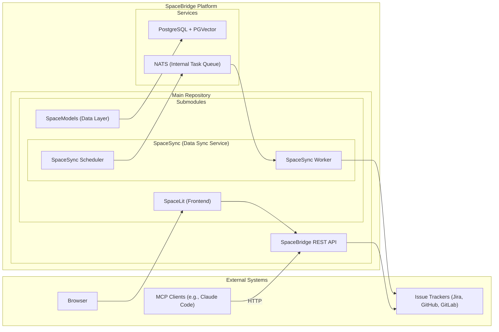
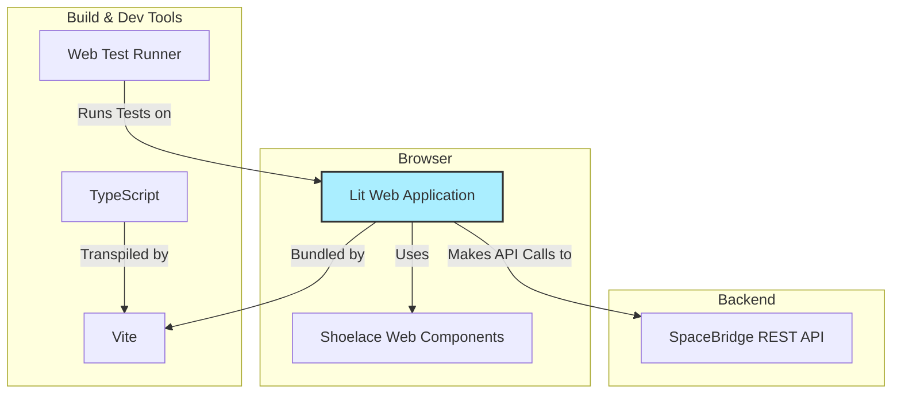
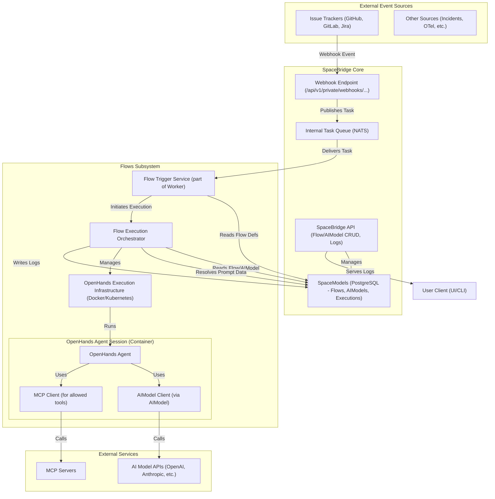
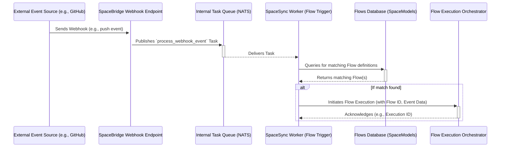
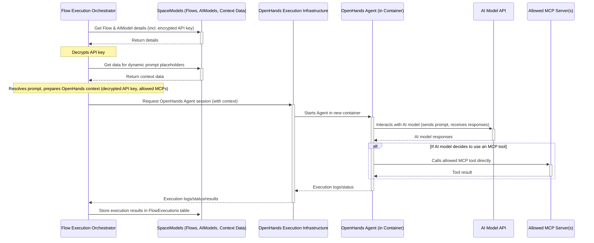
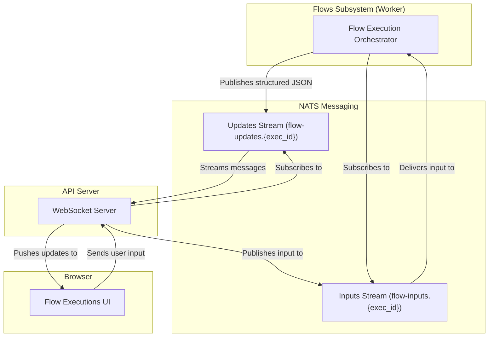
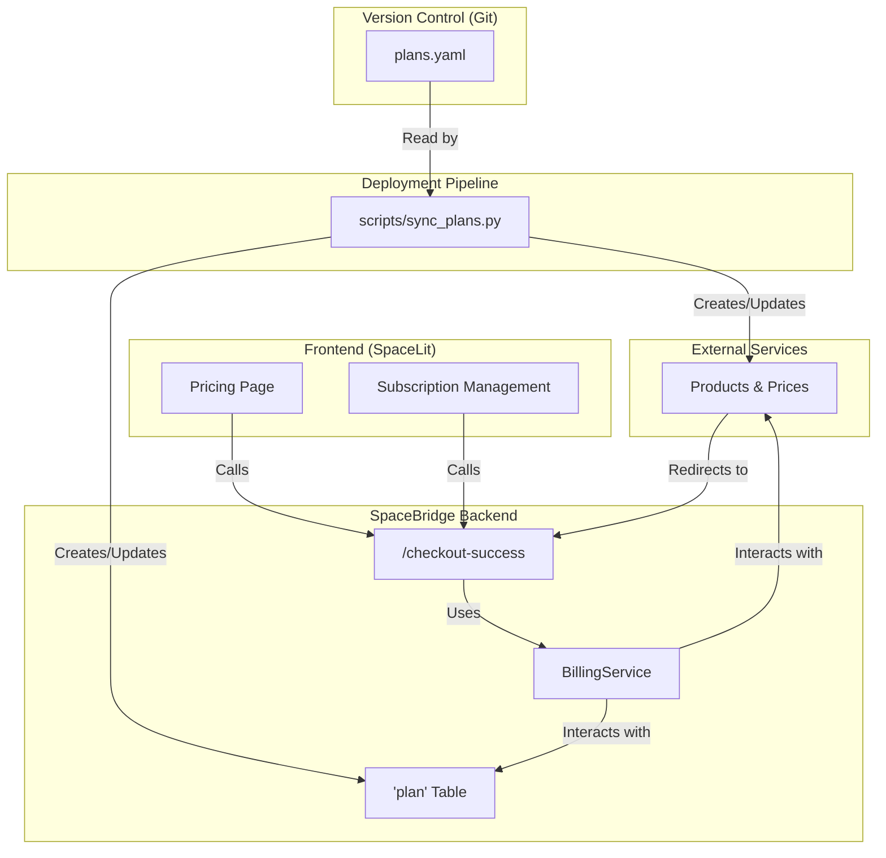
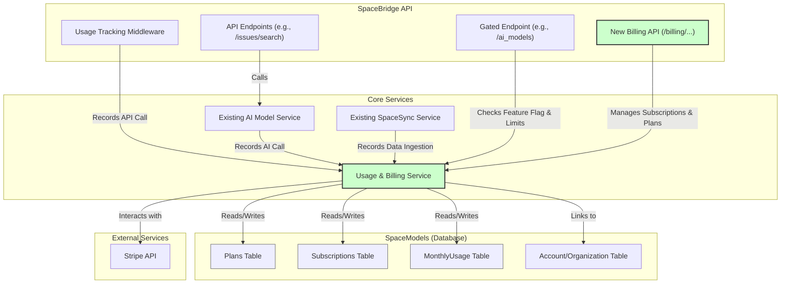

# SpaceBridge Architecture

## System Overview

SpaceBridge is an AI-driven platform designed to enhance product development by deeply integrating with issue tracking systems. It provides a modular, scalable RESTful API that ingests issues, comments, and documentation from multiple platforms like Jira, GitHub, and GitLab. By leveraging vector-based similarity search, SpaceBridge detects duplicate issues, evaluates compliance metrics, and offers intelligent suggestions to streamline workflows. The architecture emphasizes flexibility, performance, and ease of integration, providing access via a REST API, a web UI, and an MCP server for various clients.

## High-Level Architecture



**Key Components:**

*   **SpaceBridge REST API (Main Repository):** The core FastAPI application providing the HTTP interface.
*   **SpaceModels (Submodule):** Handles database interactions, defining SQLAlchemy models, Pydantic schemas, and CRUD operations. Manages the PostgreSQL database connection and PGVector operations.
*   **SpaceSync (Submodule):** A service responsible for polling external issue trackers, processing data, generating embeddings, and storing/updating information in the database via `SpaceModels`. The spacesync cli can launch one-off scan operations, or start the scheduler process that adds polling tasks to the NATS queue. The NATS queue is consumed by the SpaceSync worker process.
    *   **SpaceSync Scheduler:** A process that adds polling tasks to the NATS queue.
    *   **SpaceSync Worker:** A process that consumes tasks from the NATS queue and processes them.
*   **SpaceLit (Submodule):** A web application built using Lit, Vite, TypeScript, and Material Web Components.
*   **PostgreSQL + PGVector:** The database storing metadata and vector embeddings.
*   **NATS:** An event bus used for both a reliable task queue (JetStream) and real-time streaming updates. It decouples the API from the background processing of events and flows.
*   **External Systems:** Issue trackers and MCP clients interacting with the SpaceBridge ecosystem.

## Frontend Architecture
The frontend is in the `SpaceLit` directory.



### Technology Stack

*   **Framework:** [Lit](https://lit.dev/) - A simple library for building fast, lightweight web components. It provides reactive state, scoped styles, and a declarative templating system.
*   **Build Tool:** [Vite](https://vitejs.dev/) - A modern frontend build tool that provides an extremely fast development experience with features like Hot Module Replacement (HMR) and optimized production builds.
*   **Language:** [TypeScript](https://www.typescriptlang.org/) - A statically typed superset of JavaScript that enhances code quality and maintainability.
*   **UI Components:** [Shoelace](https://shoelace.style/) - A set of high-quality, standards-based web components.
*   **Testing:** [Web Test Runner](https://modern-web.dev/docs/test-runner/overview/) - A tool for testing web applications in a real browser, ensuring that components behave as expected in a live environment.

### Structure

The `SpaceLit` application is structured around a component-based architecture.

*   **`src/components/`**: This directory contains all the custom Lit components that make up the application. Each component is typically defined in its own file (e.g., `tracker-list.ts`) and may have a corresponding test file (e.g., `tracker-list.test.ts`).
*   **`src/api.ts`**: A dedicated module for handling communication with the SpaceBridge REST API. It encapsulates fetch logic, authentication, and data transformation.
*   **`index.html`**: The main entry point for the application.
*   **`vite.config.ts`**: Configuration for the Vite build tool.
*   **`package.json`**: Defines project metadata, dependencies, and scripts for development, building, and testing.

## Core Components

### SpaceBridge API Server (Main Repository)
*   **Framework:** FastAPI-based RESTful API server.
*   **Authentication:** JWT authentication and authorization.
*   **MCP Server:** Includes integrated MCP tool endpoints under `/api/v1/mcp/` for direct communication with MCP clients over HTTP.
*   **Validation:** Request validation using Pydantic models (defined in `SpaceModels`).
*   **Documentation:** Automatic API documentation with Swagger/ReDoc.
*   **Features:** Rate limiting, error handling, monitoring integration.
*   **Interaction:** Communicates with `SpaceModels` for database operations and directly with Issue Tracker APIs for certain actions (e.g., creating/updating issues in real-time).

### SpaceModels (Submodule `./SpaceModels`)
*   **Purpose:** Data modeling and database interaction layer.
*   **Technology:** SQLAlchemy for ORM, Pydantic for data validation/schemas.
*   **Database:** Defines schema for PostgreSQL, including tables for organizations, projects, issues, embeddings, etc.
*   **Vector Store:** Integrates with PGVector for storing and querying issue embeddings.
*   **Operations:** Provides CRUD (Create, Read, Update, Delete) functions for all database entities.
*   **Migrations:** Uses Alembic for database schema evolution.

### SpaceSync (Submodule `./spacesync`)
*   **Purpose:** Data synchronization and embedding generation service.
*   **Functionality:**
    *   The `spacesync` CLI can launch one-off scan operations or start a persistent scheduler.
    *   **Scheduler:** Periodically adds polling tasks for each configured tracker to the NATS queue.
    *   **Worker:** Consumes tasks from the NATS queue. Multiple, specialized worker groups can be deployed, each subscribing to a specific subset of tasks (e.g., polling, webhooks). This allows for independent scaling and monitoring of different task types.
*   **Execution:** Runs as two distinct, long-running processes (scheduler and worker) or as a one-off CLI command.


### Issue Tracker Clients (within SpaceBridge & SpaceSync)
*   **Location:** Implementations reside within both the main SpaceBridge API (for direct actions) and SpaceSync (for polling). Shared logic might be abstracted.
*   **Structure:** Abstract base classes define common interfaces (`get_issue`, `create_issue`, etc.).
*   **Implementations:** Concrete classes for each supported tracker (Jira, GitHub, GitLab).
*   **Features:** Handles authentication, API specifics, rate limiting, and error mapping for each tracker.

### Database (PostgreSQL + PGVector)
*   **Role:** Central data store for metadata and vector embeddings.
*   **Managed by:** `SpaceModels` submodule.
*   **Key Features:** Relational data storage, efficient vector similarity search via PGVector.

## Data Flow

### REST API Flow (e.g., Searching Issues)
1.  **Client Request:** An HTTP client sends a `GET /api/v1/issues/search` request to the SpaceBridge API server.
2.  **API Server:**
    *   Authenticates the request (JWT).
    *   Validates query parameters (using Pydantic models from `SpaceModels`).
    *   Calls the appropriate service function.
3.  **Service Layer (API):**
    *   Generates an embedding for the search query.
    *   Calls a function in `SpaceModels` to perform a vector similarity search in the PostgreSQL/PGVector database, potentially with metadata filters.
4.  **SpaceModels:**
    *   Constructs and executes the SQL query against the database.
    *   Retrieves matching issue data.
5.  **API Server:** Formats the results and returns the HTTP response to the client.

### Data Synchronization Flow (SpaceSync)
1.  **Trigger:** `spacesync scan all` command is executed.
2.  **SpaceSync Service:**
    *   Retrieves tracker configurations using `SpaceModels`.
    *   For each configured tracker:
        *   Uses the appropriate Issue Tracker Client to poll the external API (e.g., Jira API) for new/updated issues since the last scan.
        *   Processes the fetched issues.
        *   Generates vector embeddings for new/updated issue text.
        *   Calls functions in `SpaceModels` to insert or update issue data and embeddings in the database.
3.  **SpaceModels:** Interacts with the PostgreSQL database to persist changes.

### MCP Flow (Integrated HTTP)
1.  **MCP Client Request:** An MCP client (e.g., Claude Code) sends a tool request as an HTTP POST to the relevant endpoint (e.g., `/api/v1/mcp/search`). The request includes the standard MCP JSON payload and an `Authorization: Bearer <token>` header.
2.  **SpaceBridge API Server:**
    *   Authenticates the request using the JWT token.
    *   Routes the request to the appropriate MCP tool endpoint.
    *   Validates the incoming MCP parameters against the Pydantic schema for that tool.
    *   Executes the tool logic, interacting with other SpaceBridge services and `SpaceModels` as needed.
    *   Formats the result into the standard MCP JSON response format.
3.  **MCP Client:** Receives the HTTP response containing the tool's output.

## Database Schema (Managed by SpaceModels)

The detailed schema is defined using SQLAlchemy models within the `SpaceModels` submodule. Key tables include:

*   **Organizations:** Stores organization metadata, settings, and potentially user associations.
*   **Projects:** Contains project details, tracker configurations (type, API URL, credentials), and links to organizations.
*   **Trackers:** Holds specific tracker instance details and encrypted credentials.
*   **Issues:** Stores core issue data (ID, title, description, status, labels, etc.) synchronized from trackers.
*   **Issue Embeddings:** Contains vector embeddings (using PGVector `vector` type) linked to issues, used for similarity search.
*   **Other Metadata:** Tables for comments, users, API keys, etc., as needed.

Schema migrations are managed using Alembic within `SpaceModels`.

## Integration with Existing Spacecode Infrastructure

- [ ] Authentication integration with Spacecode SSO
- [ ] Permission synchronization with central user management
- [ ] Event publishing to message bus for cross-service coordination
- [ ] Integration with Spacecode logging and monitoring systems

## Technical Decisions

### REST API Implementation
SpaceBridge implements a RESTful HTTP API using FastAPI, which provides:
- High performance with Starlette and Pydantic
- Automatic OpenAPI documentation generation
- Type annotation-based parameter validation
- Native async/await support
- Dependency injection system
- Middleware for authentication, logging, etc.

### MCP Implementation
The MCP server is implemented directly within the FastAPI application. This provides several advantages:
- **HTTP Transport:** Natively supports HTTP-based MCP clients, enabling secure remote access.
- **Unified Authentication:** Leverages the same JWT authentication as the rest of the API.
- **Code Reusability:** Directly calls internal services and CRUD operations, reducing code duplication.
- **Scalability:** Benefits from the same deployment and scaling infrastructure as the main API.

### Language and Framework
Python is chosen as the primary language due to its strong ecosystem for machine learning and data processing, which is essential for similarity search and embedding generation. FastAPI is used for the REST API due to its performance, type safety, and automatic OpenAPI documentation generation.

### Database
PostgreSQL with the PGVector extension is used. The `SpaceModels` submodule encapsulates all database interaction logic, providing a clean separation from the API and synchronization services. This allows for centralized data management and schema evolution.

### Authentication
A JWT-based authentication system is implemented for the REST API, with integration points for existing Spacecode authentication services. This allows for flexible identity management while maintaining security.

### Deployment
The system is designed to be containerized using Docker, enabling easy deployment in various environments including Kubernetes clusters. Stateless components enable horizontal scaling under load.

## Security Considerations

- [ ] All API requests authenticated and authorized
- [ ] Issue tracker credentials encrypted at rest
- [ ] Sensitive data masked in logs
- [ ] Rate limiting to prevent abuse
- [ ] Input validation for all parameters
- [ ] Regular security audits and dependency updates

## Performance Considerations

- [ ] Connection pooling for database and external APIs
- [ ] Caching frequently accessed data
- [ ] Asynchronous processing for long-running operations
- [ ] Pagination for large result sets
- [ ] Efficient vector similarity algorithms
- [ ] Background indexing of issue embeddings

## Event-Driven Agentic Flows

This section details the architecture for the "Event-Driven Agentic Flows" (Flows) feature, enabling automated workflows triggered by various events and executed by AI agents.

### 1. Overview and Goals

The "Flows" feature allows users to define automated workflows that are initiated by events from integrated systems (e.g., GitHub, GitLab, Jira) or other sources (e.g., incidents, OpenTelemetry data). Each Flow leverages a configurable AI model and a dynamic prompt to perform tasks, potentially utilizing specified MCP (Meta-Cognitive Prompting) servers and tools.

**Key Goals:**

*   **Event-Driven Automation:** Trigger workflows based on specific events (e.g., commit to main, new issue, PR merged, incident triggered).
*   **Dynamic Prompting:** Allow prompts to be constructed dynamically, incorporating project-specific context (e.g., documentation summaries, code component maps).
*   **Configurable AI Models:** Enable users to select and configure different AI models for different Flows, managing API keys securely.
*   **Controlled Tool Usage:** Provide a mechanism to specify which MCP servers and tools an AI agent can use during a Flow's execution.
*   **Extensibility:** Design for easy addition of new event sources, AI models, and agent capabilities.
*   **User Experience:** Allow users to define Flows from presets, customize existing ones, or create them from scratch. The UI should be intuitive and guide the user through the process of creating and configuring a flow.

### 2. Key Components & Their Roles



*   **Flow Definition (`Flows`):**
    *   Stored in the `SpaceModels` database.
    *   Details the triggering event, prompt template, selected `AIModel` ID, OpenHands agent configuration (e.g., specific agent type, parameters), and a list of allowed MCP servers and specific tools.
    *   Presets are implemented as special, non-editable (or cloneable) records in this table.
*   **AI Model (`AIModel`):**
    *   Stored in `SpaceModels`.
    *   Reusable definitions for AI models, including their identifiers (e.g., `openai/gpt-4`), API endpoints, and credentials.
    *   For initial implementation, API keys will be stored unencrypted directly in the database. A future enhancement will integrate a secrets management solution like OpenBAO.
    *   Models are linked to an `Account`.
*   **Event Ingestion:**
    *   Primarily through the existing webhook endpoint (e.g., `/api/v1/private/webhooks/{tracker_type}/{org_identifier}`) for tracker events.
    *   This endpoint validates incoming webhooks and then publishes a `process_webhook_event` task to the **Internal Task Queue (NATS)**.
*   **Internal Task Queue (NATS):**
    *   NATS is used as a simple, reliable task queue. It decouples the API from the background processing of events and flows.
    *   The `EventBus` service is used to enqueue tasks.
    *   Workers consume tasks from the `spacesync.tasks` subject using a `workqueue` retention policy, which ensures that acknowledged messages are immediately removed from the stream.
*   **Flow Trigger Service:**
    *   This logic is part of the NATS worker. When a `process_webhook_event` task is received, the worker acts as the trigger service.
    *   It matches the incoming event data against the `trigger_event_source` and `trigger_event_type` defined in active `Flows`.
    *   Upon a match, it initiates a Flow execution by invoking the Flow Execution Orchestrator.
*   **Flow Execution Orchestrator:**
    *   Responsible for managing the lifecycle of a single Flow execution.
    *   Retrieves the `Flow` definition and its associated `AIModel` (including the encrypted API key) from the database.
    *   **Dynamic Prompt Resolution:** Parses the `prompt_template` and resolves any placeholders (e.g., `{{project_docs_summary}}`, `{{relevant_code_files}}`) by querying `SpaceModels` or other SpaceBridge services for the necessary context data.
    *   Decrypts the API key and prepares the complete execution context for OpenHands, including the fully resolved prompt, AI model details (model name, API endpoint, decrypted API key), and the specific list of allowed MCP servers/tools.
    *   Initiates and manages an OpenHands agent session, potentially by requesting a new container from the OpenHands Execution Infrastructure.
    *   Monitors the execution and records results/logs.
*   **OpenHands Execution Infrastructure:**
    *   Manages the runtime environment for OpenHands agents.
    *   As per OpenHands capabilities, this will involve spinning up a new container (e.g., via Docker socket on localhost or as a Kubernetes job) for each Flow execution. This ensures isolation and scalability.
    *   The Flow Execution Orchestrator will interact with this infrastructure to start, monitor, and terminate agent sessions.
*   **OpenHands Agent (running in a container):**
    *   The core agentic execution environment provided by the OpenHands library.
    *   Receives the resolved prompt, AI model configuration , and allowed MCP toolset from the Flow Execution Orchestrator.
    *   Manages the interaction with the configured AI model.
    *   **Direct MCP Calls:** The AI model, operating within the OpenHands agent, will directly call the allowed MCP tools on the specified MCP servers. OpenHands will need to be configured or provided with the necessary network access and potentially authentication details (if any) for these MCP servers.
*   **Flow Execution Log (`FlowExecutions`):**
    *   A database table in `SpaceModels` to record the history and outcome of each Flow run.
    *   Includes details like the triggering event, start/end times, status (pending, running, succeeded, failed), the resolved input prompt, a summary of actions taken by the agent, logs of MCP tool usage, and a reference to more detailed logs from the OpenHands session (e.g., container logs or a session ID).
*   **SpaceBridge API Extensions:**
    *   New API endpoints will be added to the `SpaceBridge API` for:
        *   CRUD (Create, Read, Update, Delete) operations on `Flows` and `AIModels`.
        *   Listing and retrieving `FlowExecution` history and logs.
        *   Managing Flow presets (e.g., listing, cloning).

### 3. Database Schema Considerations (Conceptual)

The following Pydantic schemas and corresponding SQLAlchemy models will be defined within `SpaceModels`:

*   **`Flow` Table/Schema:**
    *   `id`: Primary Key (e.g., UUID)
    *   `name`: String (User-defined name for the Flow)
    *   `description`: Text (Optional description)
    *   `icon`: String (Optional, name of a Shoelace icon or a URL to a custom icon)
    *   `trigger_event_source`: String (e.g., 'github', 'jira', 'gitlab', 'custom_event', 'scheduled')
    *   `trigger_event_type`: String (e.g., 'commit_to_main', 'new_issue_created', 'incident_triggered', 'daily_scan')
    *   `trigger_config`: JSON (Optional, for more complex trigger conditions, e.g., specific branch for commits, specific labels for issues)
    *   `prompt_template`: Text (The prompt template with placeholders like `{{placeholder_name}}`)
    *   `ai_model_id`: Foreign Key to `AIModel.id`
    *   `openhands_agent_config`: JSON (Configuration for the OpenHands agent, e.g., `{"agent_type": "CodeActAgent", "max_iterations": 10}`)
    *   `allowed_mcp_servers`: JSON Array of strings (e.g., `["spacebridge-mcp", "code_analysis_mcp"]`)
    *   `allowed_mcp_tools`: JSON Array of objects (e.g., `[{"server_name": "spacebridge-mcp", "tool_name": "search_issues"}, {"server_name": "code_analysis_mcp", "tool_name": "lint_file"}]`)
    *   `is_preset`: Boolean (Indicates if this is a system-defined preset)
    *   `is_enabled`: Boolean (Allows users to enable/disable Flows)
    *   `account_id`: Foreign Key to `Account.id`
    *   `created_at`: Timestamp
    *   `updated_at`: Timestamp

*   **`AIModel` Table/Schema:**
    *   `id`: Primary Key (UUID)
    *   `name`: String (User-defined name for this model configuration)
    *   `description`: Text (Optional description)
    *   `provider_name`: String (e.g., 'openai', 'anthropic')
    *   `model_identifier`: String (Standardized identifier, e.g., 'gpt-4-turbo')
    *   `api_endpoint`: String (URL for the model's API, if not standard)
    *   `api_key`: String (Stores the API key, unencrypted for now)
    *   `account_id`: Foreign Key to `Account.id`
    *   `is_default`: Boolean (Indicates if this is the default model for the account)
    *   `model_parameters`: JSON (Optional, for model-specific parameters like temperature, max_tokens)
    *   `meta_data`: JSON (Optional, for custom fields, labels, etc.)
    *   `created_at`: Timestamp
    *   `updated_at`: Timestamp

*   **`FlowExecution` Table/Schema:**
    *   `id`: Primary Key (e.g., UUID)
    *   `flow_id`: Foreign Key to `Flows.id`
    *   `trigger_event_id`: String (Optional, an identifier for the specific event that triggered this execution, if available from the event source)
    *   `trigger_event_details`: JSON (A snapshot of the payload of the triggering event)
    *   `status`: String (e.g., 'PENDING', 'INITIALIZING', 'RUNNING', 'COMPLETING', 'SUCCEEDED', 'FAILED', 'CANCELLED', 'TIMED_OUT')
    *   `start_time`: Timestamp
    *   `end_time`: Timestamp (Nullable)
    *   `resolved_input_prompt`: Text (The full prompt after placeholder resolution)
    *   `model_output_summary`: Text (Optional, a concise summary of the AI model's final output or key findings)
    *   `actions_taken_summary`: JSON Array (A structured log of significant actions performed by the agent, e.g., files created, MCP tools called with parameters)
    *   `mcp_usage_logs`: JSON Array of objects (Detailed log of each MCP tool call: `{"server_name", "tool_name", "arguments", "timestamp", "status", "result_summary"}`)
    *   `openhands_session_reference`: String (e.g., OpenHands session ID, Kubernetes job ID, Docker container ID, or path to detailed logs)
    *   `error_message`: Text (If status is 'FAILED', stores the error message or stack trace)
    *   `created_at`: Timestamp
    *   `updated_at`: Timestamp

### 4. Data Flow Diagrams

*(Mermaid diagrams will be used here as shown in the "Key Components" section and expanded as needed for specific flows.)*

**a. Event Ingestion & Flow Triggering:**



**b. Flow Execution (Simplified):**



### 5. Interaction with Existing Components

*   **`SpaceModels`:**
    *   Will house the new SQLAlchemy models and Pydantic schemas for `Flows`, `AIModels`, and `FlowExecutions`.

### 6. Real-Time UI Updates & Interactivity

To provide users with live feedback and enable future interactivity with Flow executions, a structured, message-based real-time architecture will be implemented.



**Components & Protocol:**

*   **Structured Messaging:** Communication will use a standardized JSON envelope, allowing for different message types. This is critical for future extensibility.
    ```json
    {
      "execution_id": "uuid-of-the-flow-execution",
      "timestamp": "iso-8601-timestamp",
      "type": "message_type",
      "payload": { ... }
    }
    ```
*   **NATS Streams:**
    *   **`flow-updates.{execution_id}`:** A server-to-client stream for broadcasting updates from the `FlowExecutionOrchestrator`. This will be implemented now.
    *   **`flow-inputs.{execution_id}`:** A client-to-server stream for sending user input back to the `FlowExecutionOrchestrator`. This is reserved for future interactive features.
*   **WebSocket Server:** The server will handle routing messages between the browser and the appropriate NATS streams.
*   **Initial Message Types:** For the first implementation, the following message types will be supported in the `flow-updates` stream:
    *   `status_update`: For lifecycle changes (e.g., `RUNNING`, `SUCCEEDED`).
    *   `log`: For streaming text output from the agent.
    *   `tool_call`: For structured information about tools being used.
*   **Future Extensibility:** This design allows for the seamless addition of new message types to support interactivity (`user_input_request`, `user_input_response`) or advanced capabilities (`ui_control_command`) without requiring architectural changes.
    *   CRUD operations for these new entities will be added to `SpaceModels`.
    *   Will be queried by the Flow Execution Orchestrator to resolve dynamic prompt content.
*   **`SpaceSync` / Webhook Infrastructure:**
    *   The existing webhook ingestion mechanism within the main `SpaceBridge API` will publish a `process_webhook_event` task to the NATS task queue.
    *   The `SpaceSync` worker, upon receiving this task, will be responsible for triggering the appropriate Agentic Flows.
*   **`SpaceBridge API`:**
    *   Will be extended with new RESTful API endpoints for:
        *   Managing `Flows` (CRUD, enable/disable, list presets).
        *   Managing `AIModels` (CRUD, share).
        *   Retrieving `FlowExecution` history, status, and logs (including links or content from OpenHands logs).
*   **`SpaceBridge-MCP` (and other MCP Servers):**
    *   MCP servers are *consumers* in this context. The OpenHands agents, as configured per Flow, will directly call tools on these MCP servers.
    *   The `Flow` definition will specify which MCP servers and which specific tools on those servers the agent is permitted to use.

### 6. OpenHands Integration - Key Aspects

*   **Flow to OpenHands Configuration:** The `Flow.openhands_agent_config` field will store JSON specifying the OpenHands agent type (e.g., `CodeActAgent`, `PlannerAgent`) and any necessary parameters for that agent. The Flow Execution Orchestrator translates this, along with the resolved prompt and AI model details, into the arguments needed to start an OpenHands session.
*   **Dynamic Prompts:** The Flow Execution Orchestrator resolves placeholders in `Flow.prompt_template` *before* passing the final prompt to OpenHands.
*   **AI Model Selection & API Key Management:**
    *   `Flow.ai_model_id` links to a `AIModel` record.
    *   `AIModel.api_key_encrypted` stores the encrypted API key in the database (for initial implementation).
    *   The Flow Execution Orchestrator is responsible for retrieving this encrypted key, decrypting it, and passing the plaintext API key securely to the OpenHands agent session, ideally as an environment variable or secure input specific to that containerized session. (Future: Retrieve from OpenBAO via a reference).
*   **MCP Tool Discovery & Invocation:**
    *   The `Flow.allowed_mcp_servers` and `Flow.allowed_mcp_tools` define the explicit allowlist.
    *   The OpenHands agent environment will need to be configured such that it can make network calls to these allowed MCP servers.
    *   If MCPs require authentication, mechanisms for securely providing necessary tokens/keys to the OpenHands agent for *only* the allowed MCPs will be needed. This might involve the Flow Execution Orchestrator injecting temporary credentials or connection details into the OpenHands session.
    *   OpenHands' own tool/action definition capabilities will be used to represent the allowed MCP tools to the AI model.

### 7. Security Considerations

*   **API Key Security:**
    *   **Initial Implementation:** AI model API keys (`AIModel.api_key`) will be stored unencrypted in the database.
    *   **Future Enhancement (OpenBAO Integration):** An issue should be tracked to migrate to storing API keys in OpenBAO (or a similar dedicated secrets management system). The database would then store only a reference to the secret in OpenBAO.
    *   The Flow Execution Orchestrator needs appropriate permissions to decrypt these keys (initial phase) or retrieve them from the vault (future phase) at runtime and inject them securely into the OpenHands agent's environment.
    *   Least privilege access for the orchestrator to decryption keys or the secrets vault.
*   **MCP Access Control:**
    *   The `allowed_mcp_servers` and `allowed_mcp_tools` in the `Flow` definition act as a strict allowlist.
    *   The OpenHands agent environment must be configured (e.g., network policies if running in Kubernetes, or wrapper logic around tool calls) to prevent calls to unlisted MCPs or tools.
    *   Consider if MCPs themselves have authentication/authorization; if so, the Flow execution might need to propagate user/Flow identity or use pre-configured service accounts.
*   **Input Validation & Sanitization:**
    *   Validate all inputs for Flow definitions, especially prompt templates and configurations.
    *   Sanitize any data from events or dynamic context before it's incorporated into prompts to prevent injection attacks against the AI model or downstream tools.
*   **Resource Limits for Agents:**
    *   OpenHands agents (especially if running in containers) should have resource limits (CPU, memory, execution time) to prevent abuse or runaway processes.
*   **Logging and Auditing:**
    *   Comprehensive logging of Flow executions, including which MCP tools were called with what parameters (sensitive data redacted).
    *   Audit trails for changes to `Flows` and `AIModels`.
*   **Permissions:**
    *   Role-based access control (RBAC) for managing `Flows` and `AIModels` via the SpaceBridge API. Users should only be able to create/edit/view Flows and AIModels within their authorized scope (e.g., organization).

### 8. Scalability and Extensibility

*   **Task Queue (NATS):** NATS is chosen for its high performance, lightweight nature, and scalability, allowing the system to handle a high volume of incoming tasks.
*   **Flow Trigger Service:** Can be scaled horizontally if event processing becomes a bottleneck. It should be stateless.
*   **Flow Execution Orchestrator:** Can also be scaled, though individual orchestration tasks might be stateful for the duration of a Flow.
*   **OpenHands Execution Infrastructure:**
    *   Leveraging containers (Docker or Kubernetes jobs) for OpenHands agents is key to scalability. Each Flow execution runs in an isolated container.
    *   The system can be configured to run these containers on a Docker host (via socket) or a Kubernetes cluster, allowing for dynamic scaling of agent execution capacity based on demand.
    *   The orchestrator will manage the lifecycle of these containerized jobs.
*   **Database:** `SpaceModels` (PostgreSQL) should be monitored for performance. Read replicas can be used for read-heavy operations like fetching Flow definitions or execution logs.
*   **Extensibility:**
    *   **New Event Sources:** Add new parsers/adapters to publish `process_webhook_event` tasks. The Flow Trigger Service can then match these new event types.
    *   **New AI Models:** Add new `AIModel` records. The Flow Execution Orchestrator and OpenHands need to be compatible with the new model's API.
    *   **New MCP Tools/Servers:** Update the allowlist options. OpenHands agents need to be able to make calls to these new tools.
    *   **New Agent Capabilities:** As OpenHands evolves or new agent frameworks emerge, the Flow Execution Orchestrator can be adapted to integrate with them.

### 9. Preset Use Case Examples

## Usage, Billing, and Plans

This section outlines the architecture for tracking API/feature usage, managing subscription plans, and integrating with Stripe for billing.

### 1. Plan Management: Source of Truth

The single source of truth for all subscription plans is a YAML file named `plans.yaml` located in the root of the repository. This approach ensures that plan definitions are version-controlled and can be easily reviewed and modified.

A Python script, `scripts/sync_plans.py`, is responsible for synchronizing this YAML file with both the Stripe API and the SpaceBridge database. This script is executed as part of the deployment pipeline to ensure all environments are consistent.

### 2. Architecture Overview



### 3. Database Schema (`SpaceModels`)

Four tables are used to manage billing and subscriptions:

*   **`Account`:** The existing `Account` model has been updated to include a `stripe_customer_id` field, which links a user to their customer record in Stripe.
*   **`Plan`:** Stores the details of each subscription plan, mirroring the structure of `plans.yaml`. It includes a `stripe_product_id` to link to the corresponding product in Stripe, as well as fields to support custom, account-specific plans.
*   **`Subscription`:** Links an `Account` to a `Plan`. It tracks the subscription's status, current billing period, and stores the `stripe_subscription_id`.
*   **`MonthlyUsage`:** Records aggregated usage for each subscription on a monthly basis. A JSONB column `usage_counts` stores key-value pairs for different tracked metrics (e.g., `ai_calls`, `issues_ingested`).

### 4. Core Logic and Data Flow

*   **Usage Tracking:** The `BillingService` provides a `record_usage(account_id, metric)` method. This method is called from specific, high-value locations in the codebase (e.g., within `SpaceSync` when an issue is ingested or an embedding is generated). It increments the appropriate counter in the `MonthlyUsage` table for the current billing cycle.
*   **Limit Enforcement:** A `check_limit(account_id, metric)` method in the `BillingService` determines if an account has exceeded its usage for a given metric based on its current plan. If no active subscription is found, the limits of the "free" plan are applied. The API endpoints use this to return a `429 Too Many Requests` error when a limit is reached.
*   **Checkout & Portal:** The `BillingService` integrates with the Stripe API to create Checkout sessions (for new subscriptions) and Customer Portal sessions (for managing existing subscriptions). The API endpoints expose these functions to the frontend.
*   **Subscription Creation:** When a user successfully completes a checkout, Stripe redirects them to a `/checkout-success` endpoint in the SpaceBridge API. This endpoint retrieves the session details from Stripe, creates the `Subscription` record in the local database, and then redirects the user to the subscription management page.

### 5. Stripe Integration

*   **Products and Prices:** The `sync_plans.py` script creates a "Product" in Stripe for each plan ID (e.g., "pro") and attaches monthly and annual "Prices" to it.
*   **Customers:** A Stripe "Customer" is created for a SpaceBridge `Account` the first time they initiate a checkout session. The `stripe_customer_id` is stored on the `Account` model.
*   **Subscriptions:** When a user successfully completes a checkout, a Stripe "Subscription" is created. The `/checkout-success` handler then creates a corresponding `Subscription` record in the SpaceBridge database.

*   **Commit to `main` -> Doc/Test Check:** When a commit lands in the `main` branch, evaluate if documentation or tests require updates. If so, check if these updates have been applied. If not, open an issue detailing what needs to be done, and/or open a Pull Request with suggested changes.
*   **New Issue Created -> Triage & Label:** Analyze new issue content, suggest priority, labels, and potentially assign to a default team/person based on keywords or project area.
*   **PR Merged -> Release Notes Draft:** Summarize changes in the Pull Request (commit messages, linked issues) and draft a section for the project's release notes.
*   **Downtime Incident (e.g., from PagerDuty/Opsgenie webhook) -> Initial Investigation:** When an incident is triggered, check the deployed version, deployment time, and relevant telemetry data. Attempt to determine the potential cause and suggest or perform initial remediation actions (e.g., rollback, restart service, scale resources) or escalate to a human with a summary.
*   **New User Feedback (e.g., via a dedicated form or email integration) -> Summarize & Categorize:** Parse incoming user feedback, summarize key points, categorize it (e.g., bug report, feature request, question), and create a corresponding issue in the appropriate tracker.
*   **Scheduled Code Quality Scan (e.g., triggered by an internal cron-like event) -> Analyze & Report:** Trigger a static analysis tool (or use an MCP tool that does this), have the agent review the results, summarize critical issues, and create tasks for them in the issue tracker.


## Usage, Billing, and Plans

To support different subscription tiers and enforce usage limits, a comprehensive usage tracking and billing system is integrated into SpaceBridge. This system is designed to be scalable, accurate, and have minimal performance overhead.

### 1. Plan Management: Source of Truth

Subscription plans (e.g., Free, Pro) and their associated features/limits are defined in a version-controlled `plans.yaml` file at the root of the repository. This file serves as the single source of truth.

A synchronization script (`scripts/sync_plans.py`) is responsible for:
1.  Reading `plans.yaml`.
2.  Creating or updating corresponding "Products" and "Prices" in the Stripe dashboard via the Stripe API.
3.  Seeding or updating the `plans` table in the SpaceBridge database.

This approach ensures that plan definitions are tied to the application's version history.

### 2. Architecture Overview

The system introduces a new `Usage & Billing Service` that acts as the central authority for all plan-related logic. It interacts with new database models in `SpaceModels` and is integrated into the API layer via middleware and dependencies.



### 2. Database Schema (`SpaceModels`)

Three new tables are added to manage billing and usage:

*   **`Plans` Table**: Defines the available subscription plans (e.g., Free, Pro, Ultra).
    *   `id`: Primary Key
    *   `name`: String
    *   `price_monthly`: Numeric
    *   `is_active`: Boolean
    *   `features`: JSONB. A flexible field to store all limits and feature flags for the plan.
        *   *Example*: `{"api_calls_monthly": 10000, "ai_calls_monthly": 100, "issues_ingested_monthly": 1000, "custom_ai_models_enabled": false, "custom_compliance_metrics_enabled": false}`

*   **`Subscriptions` Table**: Links an `Organization` to a `Plan` and tracks the billing cycle.
    *   `id`: Primary Key
    *   `organization_id`: Foreign Key to `Organizations.id`
    *   `plan_id`: Foreign Key to `Plans.id`
    *   `status`: String (e.g., "active", "trialing", "past_due", "canceled")
    *   `current_period_start`: Timestamp
    *   `current_period_end`: Timestamp
    *   `stripe_subscription_id`: String (Links to the subscription in Stripe)

*   **`MonthlyUsage` Table**: Stores aggregated usage data for each organization per billing cycle.
    *   `id`: Primary Key
    *   `subscription_id`: Foreign Key to `Subscriptions.id`
    *   `billing_cycle_start`: Date
    *   `billing_cycle_end`: Date
    *   `usage_counts`: JSONB. Stores aggregated counts for each tracked metric.
        *   *Example*: `{"api_calls": 8500, "ai_calls": 75, "issues_ingested": 450}`

### 3. Core Logic and Data Flow

*   **Usage Recording**:
    1.  A **FastAPI Middleware** intercepts every API request and calls `UsageService.record_usage(org_id, "api_calls")`.
    2.  Specific services, like the **AI Model Service** or **SpaceSync**, call `UsageService.record_usage(...)` for more granular events (e.g., `"ai_calls"`, `"issues_ingested"`).
    3.  The `UsageService` finds the current `MonthlyUsage` record for the organization and atomically increments the relevant counter in the `usage_counts` JSONB field.

*   **Limit Enforcement**:
    1.  Endpoints that consume a limited resource are protected by a FastAPI dependency.
    2.  The dependency calls `UsageService.check_limit(org_id, "metric_name")`.
    3.  The service compares the current value in `MonthlyUsage.usage_counts` against the limit defined in `Plans.features`.
    4.  If the limit is exceeded, the API returns a `429 Too Many Requests` error, prompting the user to upgrade.

*   **Feature Gating**:
    1.  Endpoints for plan-specific features (e.g., creating a custom AI model) are protected by a dependency that calls `UsageService.has_feature(org_id, "feature_name")`.
    2.  The service checks for the presence and value of the feature flag in the organization's `Plans.features` object.
    3.  If the feature is not enabled, the API returns a `403 Forbidden` error.

### 4. Stripe Integration

The `Usage & Billing Service` will be responsible for all interactions with the Stripe API. This includes:
*   Creating and managing Stripe Customers and Subscriptions.
*   Handling webhooks from Stripe to update subscription statuses (e.g., `invoice.payment_succeeded`, `customer.subscription.deleted`).
*   Initiating checkout sessions for new subscriptions or plan upgrades.
