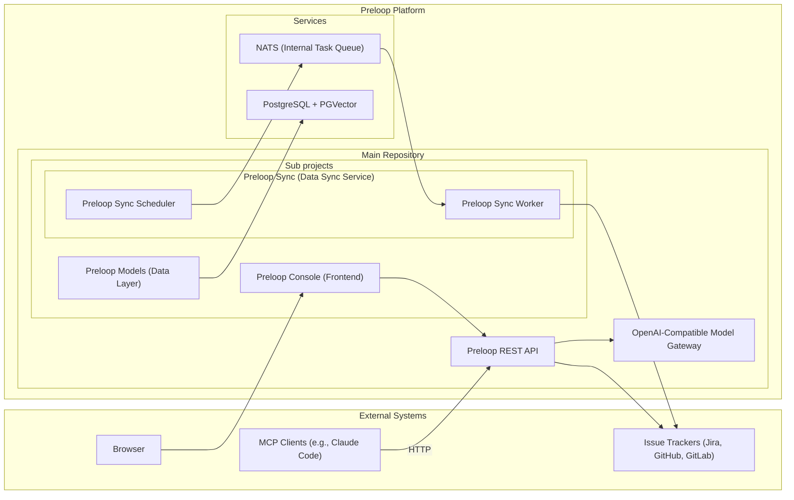
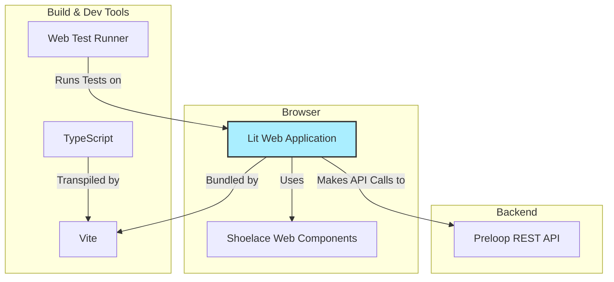
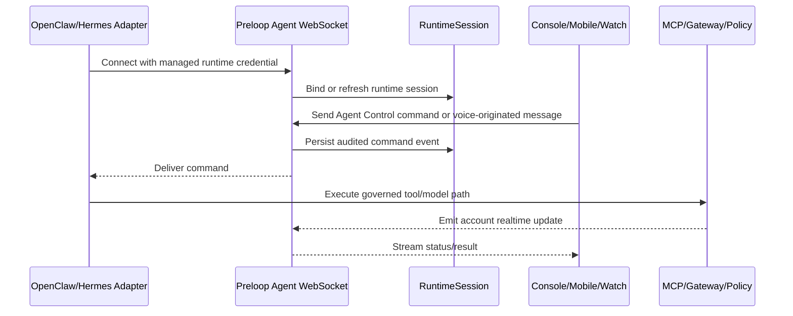
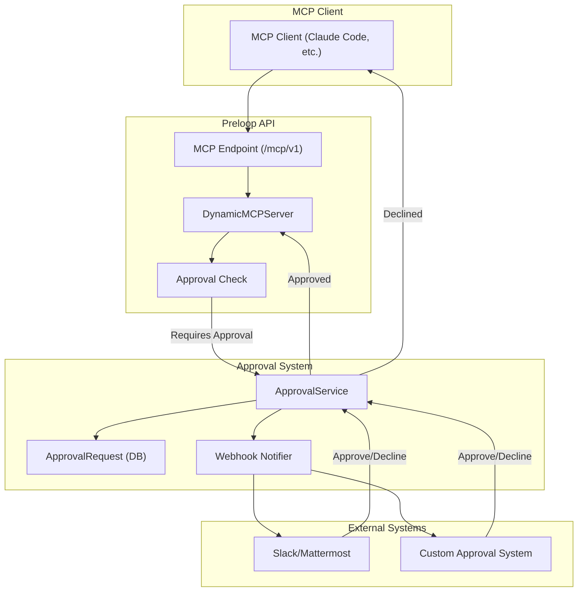

# Preloop Architecture

## System Overview

Preloop is an open-source, responsible AI automation platform. It can proxy tools from MCP servers, optionally adding a human approval layer with configurable policies. It provides event-driven agentic flows to intelligently automate common tasks using agent frameworks like Claude Code, Codex CLI, OpenCode, Gemini CLI, Aider or OpenHands. It integrates with issue & code tracking systems like Jira, GitHub, GitLab, both for listening to events and for ingesting issues, comments, documentation and code. By leveraging vector-based similarity search, Preloop detects duplicate and overlapping issues, detects unmapped dependencies, evaluates compliance metrics, and offers intelligent suggestions to streamline workflows. The architecture now also includes Preloop-owned model-gateway surfaces so managed runtimes can route model traffic through a central enforcement point for telemetry, budgets, session observability, and secret custody. The architecture emphasizes flexibility, performance, and ease of integration, providing access via a REST API, a web UI, and an MCP server for various clients.

## High-Level Architecture

**Key Components:**

*   **Preloop REST API:** The core FastAPI application providing the HTTP interface.
    It now also exposes Preloop-owned model-gateway surfaces for managed runtime traffic.
*   **Preloop Models:** Handles database interactions, defining SQLAlchemy models, Pydantic schemas, and CRUD operations. Manages the PostgreSQL database connection and PGVector operations.
    This layer now includes `SecretReference` for provider credentials, `ApiUsage` gateway attribution for model usage, costs, and runtime principals, and account-scoped model pricing metadata used by cost analytics.
*   **Preloop Sync:** A service responsible for polling external issue trackers, processing data, generating embeddings, and storing/updating information in the database via `Preloop Models`. The preloop-sync cli can launch one-off scan operations, or start the scheduler process that adds polling tasks to the NATS queue. The NATS queue is consumed by the Preloop Sync worker process.
    *   **Preloop Sync Scheduler:** A process that adds polling tasks to the NATS queue.
    *   **Preloop Sync Worker:** A process that consumes tasks from the NATS queue and processes them.
*   **Preloop Console:** A web application built using Lit, Vite, TypeScript, and Material Web Components.
*   **PostgreSQL + PGVector:** The database storing metadata and vector embeddings.
*   **NATS:** An event bus used for both a reliable task queue (JetStream) and real-time streaming updates. It decouples the API from the background processing of events and flows.
    Gateway model-call events can be emitted into the same execution update channel used by flow runtime updates, and the same pattern should later support non-flow runtime sessions.
*   **External Systems:** Issue trackers and MCP clients interacting with the Preloop ecosystem.

## Frontend Architecture
The frontend is in the `frontend` directory.

### Technology Stack

*   **Framework:** [Lit](https://lit.dev/) - A simple library for building fast, lightweight web components. It provides reactive state, scoped styles, and a declarative templating system.
*   **Build Tool:** [Vite](https://vitejs.dev/) - A modern frontend build tool that provides an extremely fast development experience with features like Hot Module Replacement (HMR) and optimized production builds.
*   **Language:** [TypeScript](https://www.typescriptlang.org/) - A statically typed superset of JavaScript that enhances code quality and maintainability.
*   **UI Components:** [Shoelace](https://shoelace.style/) - A set of high-quality, standards-based web components.
*   **Testing:** [Web Test Runner](https://modern-web.dev/docs/test-runner/overview/) - A tool for testing web applications in a real browser, ensuring that components behave as expected in a live environment.

### Structure

The `Preloop Console` application is structured around a component-based architecture.

*   **`src/components/`**: This directory contains all the custom Lit components that make up the application. Each component is typically defined in its own file (e.g., `tracker-list.ts`) and may have a corresponding test file (e.g., `tracker-list.test.ts`).
*   **`src/api.ts`**: A dedicated module for handling communication with the Preloop REST API. It encapsulates fetch logic, authentication, and data transformation.
*   **`index.html`**: The main entry point for the application.
*   **`vite.config.ts`**: Configuration for the Vite build tool.
*   **`package.json`**: Defines project metadata, dependencies, and scripts for development, building, and testing.

#### Tracker Detail Page (`src/views/authed/tracker-detail-view.ts`)

The Tracker Detail page is the entry point for issue analytics. Clicking a tracker card in the Trackers list navigates to `/console/trackers/:trackerId`, which shows:

*   **Tracker metadata:** Name, type, connection status, creation/update dates, URL, and scope rules.
*   **Issue Analytics cards:** Conditional links to Similarity, Compliance, and Dependencies views, gated by feature flags (`issue_duplicates`, `issue_compliance`, `issue_dependencies`). Each link pre-filters to projects belonging to that tracker via `?projects=` query parameters.
*   **Projects list:** All projects synced under this tracker.

Issue analytics features are no longer accessible from the main sidebar — they are scoped to individual trackers via this detail page.

#### Tools Page (`src/views/authed/tools-view.ts`)

The Tools page has been redesigned from a card-based layout to a tree-style list view:

*   **Summary stats table:** Interactive statistics panel showing tool counts (total, available/unavailable, enabled/disabled, built-in/proxied, with rules/no rules, require approval/no approval, approval workflows). Each stat is a clickable filter link.
*   **Unified filter system:** Single active filter at a time, text search, and approval workflow filter dropdown.
*   **Tool groups:** Tools grouped by source — external MCP servers listed first, then HTTP tools, then built-in tools.
*   **Import/Export:** Full configuration export/import as YAML.
*   **Key components:**
    *   `tool-list-item.ts` — Individual tool row with expand/collapse, enable/disable toggle, rule summary badges, and drag-and-drop rule reordering.
    *   `tool-rule-editor.ts` — Dialog for creating/editing access rules with action selection (deny/require approval/allow), condition builder (simple or CEL), and approval workflow configuration (human or AI-driven).
    *   `approval-policy-dialog.ts` — Dialog for creating/editing approval workflows.
*   **Access rule UI semantics:** Actions use semantic icons and colors — Deny (red, `x-octagon-fill`), Require Approval (blue/primary, `shield-lock-fill`), Allow (green, `check-circle-fill`).

#### Cost Analytics Area (`src/views/authed/cost-*`)

The Console should expose a dedicated Cost section rather than scattering spend data across gateway, sessions, and settings pages. The shared frontend can render both OSS and Enterprise panels, gated by feature flags returned by the API.

Core open-source subviews:

*   **Overview:** Daily spend, token volume, request count, budget utilization, top models, and top spenders.
*   **Breakdown:** Groupable tables and charts by model, provider, managed agent, runtime session, flow, API key, and user.
*   **Budgets:** OSS surfaces account/flow gateway limits and burn-rate health. Enterprise billing plugin owns scoped budget policy CRUD, enforcement, and notification workflows.

Enterprise feature-flagged subviews (via `plugins/billing/`):

*   **Pricing:** Per-account model price overrides for input/output/cache tokens, fixed request costs, currency, effective date, and provider-specific metadata.
*   **Session Value:** LLM-generated summaries that explain what happened in a session, whether the outcome appears worth the spend, and which expensive attempts failed or retried.
*   **Optimization:** Recommendations for cheaper model routing, prompt compaction, caching, batching, retry suppression, or policy changes.
*   **Forecasting & Anomalies:** Burn-rate forecasts, unusual spend detection, alerts, chargeback/showback, and export workflows.

## Core Components

### Preloop API Server (Main Repository)
*   **Framework:** FastAPI-based RESTful API server.
*   **Authentication:** JWT authentication and authorization.
*   **MCP Server:** Includes integrated MCP tool endpoints under `/api/v1/mcp/` for direct communication with MCP clients over HTTP.
*   **Validation:** Request validation using Pydantic models (defined in `preloop.models`).
*   **Documentation:** Automatic API documentation with Swagger/ReDoc.
*   **Features:** Rate limiting, error handling, monitoring integration.
*   **Interaction:** Communicates with `preloop.models` for database operations, directly with Issue Tracker APIs for certain actions (e.g., creating/updating issues in real-time), and with LiteLLM/provider APIs through the model gateway path.

### OpenAI-Compatible Model Gateway
*   **Purpose:** Centralize model traffic from managed runtimes behind Preloop control.
*   **Ingress:** `GET /openai/v1/models`, `POST /openai/v1/chat/completions`, `POST /openai/v1/responses`
*   **Additional Client Compatibility:** `POST /anthropic/v1/messages` for Anthropic-format clients such as `Claude Code`
*   **Streaming:** Supports SSE streaming for chat completions and responses.
*   **Authentication:** Reuses short-lived runtime bearer tokens while preserving `ApiKey` context and runtime-principal metadata.
*   **Accounting:** Persists token usage and estimated cost in `ApiUsage`.
*   **Budget Enforcement:** Applies account-level, flow-level, and subject-scoped allowed-model checks before upstream dispatch.
*   **Pricing:** Estimates cost using provider defaults unless an account-scoped model price override is active. Overrides should support different prices per token type, fixed request fees, currency, and effective-date ranges so self-hosted deployments and negotiated enterprise contracts can report realistic spend.
*   **Observability:** Emits normalized model-call events with redaction-aware request/response payload capture, provider-neutral conversation previews, and optional indexing into a gateway search corpus.
*   **Debug Surface:** Flow execution-scoped gateway events can already be queried via the flows API, runtime-session explorers can query recent session activity directly, and the operator dashboard can aggregate active sessions, recent tool calls, and daily model spend.
*   **Managed Agent Onboarding:** External agents such as OpenClaw can be enrolled so local model traffic is rewritten onto this gateway while local MCP configuration is narrowed to Preloop-managed proxy access.

### Subject-Scoped Governance
*   **Purpose:** Apply governance decisions against the concrete subject using the platform, not just the parent account.
*   **Scope Chain:** Resolution currently walks the active API key first, then the linked managed agent, and finally falls back to account defaults.
*   **Configuration Surface:** Subject-scoped governance can carry `allowed_models`, per-model budget metadata, ordered tool access rules, and `tool_enabled_overrides`.
*   **Enforcement Points:** The same subject context is propagated through MCP tool listing, policy evaluation, and model gateway budget checks so one runtime token sees only the intended tools and models.
*   **Primary Use Case:** Managed agent owners can grant a broad account-level tool catalog while restricting one enrolled desktop/CLI runtime to a tighter set of tools and models.

### Runtime Session Identity
*   **Purpose:** Provide a shared identity layer for browsing, auditing, and searching managed runtime sessions across both flows and onboarded external agents.
*   **Current Implementation:** A new additive `RuntimeSession` layer now uses flows as the first session source, bridged through `runtime_session_id`, `flow_execution_id`, runtime-principal metadata, and optional `agent_session_reference`.
*   **Current Explorer Surface:** Account-scoped runtime session list/detail endpoints now expose recent managed sessions plus their captured gateway interactions so the console can drill from aggregate usage into one session timeline.
*   **Operator Actions:** Operators can end a session explicitly, which updates runtime state, emits audit and runtime-session events, and refreshes managed-agent summaries derived from the same principal.
*   **Target Direction:** Introduce a runtime-wide session abstraction that can represent flow executions, independent CLI/desktop agent sessions, and later enrolled workforce entities without making `flow_execution` the universal long-term session model.

### Cost Analytics and Budgeting
*   **Purpose:** Turn model usage telemetry into explainable spend, enforceable budgets, and optimization guidance.
*   **Canonical Ledger:** `ApiUsage` remains the source of truth for model call tokens, estimated cost, provider, model, runtime principal, API key, flow, managed agent, and runtime-session attribution.
*   **OSS API Surface:** Core endpoints should provide aggregate summaries, grouped breakdowns, raw usage drill-downs, and budget-health alerts derived from gateway account/flow limits. Enterprise billing plugin endpoints provide budget policy CRUD, enforcement, model price override CRUD, and runtime-session optimization recommendations behind feature flags.
*   **OSS UX Boundary:** Open source should answer "how much was spent?", "who or what spent it?", and "which budget applies?" with enough drill-down to inspect the related session timeline.
*   **Enterprise UX Boundary:** Enterprise should answer "why was it spent?", "was it worth it?", and "how could it be optimized?" at scale with LLM-assisted reviews, anomaly detection, forecasting, showback/chargeback, credits/promotions, exports, and workflow automation.
*   **Default AI Model Use:** Enterprise session-value analysis should call the account's default AI model through the Preloop Gateway, producing an auditable meta-usage record for the evaluation itself. The analysis should reference redacted session summaries, gateway events, tool calls, approvals, and final outcomes rather than unrestricted raw prompts.
*   **Plugin Boundary:** Backend features beyond OSS summaries and budget-health tracking must live in Enterprise plugins under `./plugins/`, likely extending `plugins/billing/` for budget policy enforcement, pricing overrides, FinOps, credits, promotions, forecasting, exports, and value-review jobs. The shared frontend should gate those panels with feature flags.
*   **Budget Actions:** Core enforcement should continue to block or warn before upstream dispatch. Enterprise plugins can add escalations, Slack/mobile notifications, approval requirements for expensive calls, and post-hoc anomaly workflows.

### Agent Control
*   **Purpose:** Agent Control gives autonomous agents such as OpenClaw and Hermes a single, audited channel for online presence, operator messages, status updates, interruption, and future voice-originated contact.
*   **Implemented Today:** Backend Agent Control exposes `WS /api/v1/agents/control/ws` for runtime-credential agent connections and `POST /api/v1/agents/{agent_id}/control/commands` for authenticated operator text commands. It authenticates the runtime principal, binds presence to the managed agent and runtime session, publishes command envelopes through NATS when available, falls back to local delivery, emits account-scoped realtime events, and accepts heartbeat/status/presence/event envelopes from agents.
*   **Related Implemented Surfaces:** Browser, mobile, and console clients can use account-scoped realtime topics over WebSocket. Runtime sessions, managed-agent records, model-gateway usage, approval events, and operator lifecycle actions already share account-scoped event routing.
*   **Scaffolded Today:** `account_realtime` defines normalized topics such as `runtime_sessions`, `managed_agents`, `gateway_activity`, `budget_health`, and `audit`; the WebSocket manager can filter broadcasts by account and topic; frontend runtime-session and managed-agent views subscribe to those topics. Mobile/watch clients have native voice UI scaffolds that can create operator text turns, but the end-to-end user experience still depends on runtime adapters and production hardening.
*   **Runtime-Plugin Dependent:** OpenClaw and Hermes must ship and load native Preloop Agent Control runtime plugins that read `preloop.control.control_ws_url`, connect with the durable runtime bearer token, own reconnect/backoff behavior, keep the WebSocket open, send heartbeat/status events, advertise capabilities, receive `send_message` command envelopes, acknowledge delivery, and map operator messages into their own interactive runtime. Existing enrollment can rewrite MCP and model traffic even when the runtime plugin is absent, but Agent Control is not enabled until that plugin is running inside the agent process.
*   **Target Protocol:** A managed agent opens a durable WebSocket using its runtime credential, sends runtime principal/session metadata, subscribes to account and agent-specific command topics, publishes heartbeat/status updates, and acknowledges command delivery. Server-side commands should be persisted and audited before delivery so reconnecting agents can recover missed instructions.
*   **Session Prompt Semantics:** Operator text sent through Agent Control is an auditable user/operator turn for the selected runtime session. It is not a hidden system prompt, policy override, or privileged tool instruction. Runtime adapters should inject it as the next user-facing instruction in the agent's normal conversation model, preserve the current session context when possible, record the originating surface in metadata, and continue routing any resulting tool calls or model calls through the MCP firewall, model gateway, and approval policies.
*   **Security Boundary:** The channel uses the same runtime principal, subject-scoped governance, and API-key revocation model as MCP and gateway traffic. Commands that trigger tool use, model calls, or local side effects still flow through the MCP firewall, model gateway, or explicit approval policy rather than bypassing enforcement.

### Managed CLI/Desktop Agent Enrollment
*   **Discovery Entry Point:** `preloop agents discover` can stay read-only (`--json`, `--no-onboard-prompt`) or hand off interactively into managed enrollment, with `--yes` available for auto-onboarding.
*   **Shared Enrollment Engine:** `preloop agents enroll <agent>` and discovery-triggered onboarding both create or reuse a managed runtime identity, import representable MCP servers, mint a durable credential, back up the local config, and rewrite supported local endpoints to Preloop-managed MCP and gateway URLs. For Agent Control, the CLI writes the `preloop.control` contract and can delegate installation to runtime-native plugin managers, but it does not itself own the long-lived Agent Control WebSocket or execute operator commands.
*   **OpenClaw Coverage:** The current OpenClaw adapter supports legacy and newer config locations, JSON5 parsing, gateway-backed model rewrites, and conservative import of command-backed MCP entries such as `mcporter` when an upstream URL can be inferred safely.
*   **Hermes Coverage:** The Hermes adapter discovers `~/.hermes/config.yaml`/`.yml` or installed-but-unconfigured Hermes markers, preserves existing `mcp_servers`, adds a managed `preloop` HTTP MCP server, rewrites supported model configuration to Preloop's `/openai/v1` gateway, and can import provider-specific environment keys or ChatGPT/Codex OAuth material when present.
*   **Credential Boundary:** OpenClaw model credentials may be declared inline under `models.providers` or indirectly through `auth.profiles`; the enrollment path imports model metadata either way, but profile-backed provider secrets may still require manual configuration inside Preloop.
*   **Durable Identity:** `ManagedAgent.agent_kind` is now stored alongside `session_source_type` so operator UX and reporting do not depend on an active runtime session to recover the agent family.
*   **Explicit Model Association:** Onboarding now persists direct managed-agent to AI-model bindings instead of inferring one configured model indirectly from `AIModel.meta_data`.

### Mobile and Watch Voice Contact
*   **Implemented Today:** iOS, watchOS, and Android clients are documented and implemented around approval review, push notifications, QR pairing, and WebSocket-driven approval updates.
*   **Implemented Web Voice:** The web console Agent Control composer prefers browser-native `SpeechRecognition` and `speechSynthesis`, then falls back to server STT/TTS endpoints backed by speech-capable `AIModel` rows when browser audio APIs are unavailable.
*   **Scaffolded Native Voice:** iOS/watchOS and Android contain native STT/TTS or dictation scaffolds that can capture a user turn and call the Agent Control command surface, but production behavior depends on backend availability, managed-agent lookup, and OpenClaw/Hermes runtime adapters being online.
*   **Planned Voice Path:** Mobile/watch voice should start as a native app feature using vendor STT/TTS APIs, then post normalized operator messages into the same runtime session and Agent Control channel used by the console. The server remains the source of truth for transcript, command intent, approval requirements, and delivery state.
*   **Siri Constraints:** Siri Shortcuts and App Intents can launch a predefined Preloop action, capture structured parameters, and hand the user into the app. They should not be treated as a general always-listening background transport for arbitrary agent conversations.
*   **Google Assistant Constraints:** Google Assistant/App Actions can deep link into Android flows and pass structured intent data where supported, but arbitrary background agent chat or cross-app streaming is not a dependable control surface. Android should hand off to the Preloop app before sending audited commands.

### Secret Service
*   **Purpose:** Provider-agnostic custody and resolution of model credentials.
*   **Built-in Backend:** `local_encrypted` for encrypted-at-rest credentials stored in Preloop-managed storage.
*   **External Backends:** Optional Vault/OpenBao-compatible KV v2 references via `SecretReference.external_ref`.
*   **Runtime Boundary:** Gateway-enabled runtimes receive Preloop gateway tokens instead of provider API keys.

### preloop.models (`./backend/preloop/models`)
*   **Purpose:** Data modeling and database interaction layer.
*   **Current Agent/Model Shape:** `AIModel` remains the durable flat row for provider, model identifier, endpoint, and credential reference, while `ManagedAgentAIModelBinding` carries explicit per-agent config slots and primary/default selection.
*   **Deferred Normalization:** Full provider-profile normalization is intentionally deferred until agent UX and policy semantics for many-model agents stabilize; the current migration keeps compatibility fields and avoids a broader schema split.
*   **Cost Analytics Shape:** `ApiUsage` records the measured usage event. Account-scoped pricing metadata should be stored separately from `AIModel` so the same provider/model can have different cost estimates per account, contract, currency, effective date, or self-hosted deployment. Credits, promotions, invoice-grade adjustments, and chargeback rules belong in Enterprise plugin models.
*   **Technology:** SQLAlchemy for ORM, Pydantic for data validation/schemas.
*   **Database:** Defines schema for PostgreSQL, including tables for organizations, projects, issues, embeddings, etc.
*   **Vector Store:** Integrates with PGVector for storing and querying issue embeddings.
*   **Operations:** Provides CRUD (Create, Read, Update, Delete) functions for all database entities.
*   **Migrations:** Uses Alembic for database schema evolution.

### Preloop Sync ( `./backend/preloop/sync`)
*   **Purpose:** Data synchronization and embedding generation service.
*   **Functionality:**
    *   The `preloop.sync` CLI can launch one-off scan operations or start a persistent scheduler.
    *   **Scheduler:** Periodically adds polling tasks for each configured tracker to the NATS queue.
    *   **Worker:** Consumes tasks from the NATS queue. Multiple, specialized worker groups can be deployed, each subscribing to a specific subset of tasks (e.g., polling, webhooks). This allows for independent scaling and monitoring of different task types.
*   **Execution:** Runs as two distinct, long-running processes (scheduler and worker) or as a one-off CLI command.

### Issue Tracker Clients (within Preloop Sync)
*   **Location:** Implementations reside within Preloop Sync.
*   **Structure:** Abstract base classes define common interfaces (`get_issue`, `create_issue`, etc.).
*   **Implementations:** Concrete classes for each supported tracker (Jira, GitHub, GitLab).
*   **Features:** Handles authentication, API specifics, rate limiting, and error mapping for each tracker.

### Backend Project Structure

The backend codebase is organized to separate concerns between the data models, synchronization logic, and the API server.

*   **`backend/preloop/models/`**:
    *   **`models/`**: SQLAlchemy models defining the database schema (e.g., `issues.py`, `projects.py`).
    *   **`schemas/`**: Pydantic models for data validation and API I/O.
    *   **`crud/`**: Database access operations (Create, Read, Update, Delete).
    *   **`db/`**: Database connection and session management.
    *   **`alembic/`**: Database migration scripts.

*   **`backend/preloop/sync/`**:
    *   **`scanner/`**: Core logic for polling trackers and processing data.
    *   **`trackers/`**: Client implementations for different issue trackers (Jira, GitHub, GitLab).
    *   **`embeddings/`**: Logic for generating vector embeddings from issue text.
    *   **`scheduler/`**: Task scheduling logic for regular synchronization.
    *   **`worker/`**: Worker process logic for consuming tasks from NATS.

*   **`backend/preloop/api/`**:
    *   **`endpoints/`**: API route definitions grouped by resource.
    *   **`auth/`**: Authentication logic and router.
    *   **`app.py`**: FastAPI application entry point.

### Tracker Scope Rules

For detailed rules on how Organizations and Projects limit scope during syncing and searching, see the [Tracker Scope documentation](https://docs.preloop.ai/admin/tracker-scope).

### Database (PostgreSQL + PGVector)
*   **Role:** Central data store for metadata and vector embeddings.
*   **Managed by:** `preloop.models` module.
*   **Key Features:** Relational data storage, efficient vector similarity search via PGVector.

## Data Flow

### REST API Flow (e.g., Searching Issues)
1.  **Client Request:** An HTTP client sends a `GET /api/v1/issues/search` request to the Preloop API server.
2.  **API Server:**
    *   Authenticates the request (JWT).
    *   Validates query parameters (using Pydantic models from `preloop.models`).
    *   Calls the appropriate service function.
3.  **Service Layer (API):**
    *   Generates an embedding for the search query.
    *   Calls a function in `preloop.models` to perform a vector similarity search in the PostgreSQL/PGVector database, potentially with metadata filters.
4.  **preloop.models:**
    *   Constructs and executes the SQL query against the database.
    *   Retrieves matching issue data.
5.  **API Server:** Formats the results and returns the HTTP response to the client.

### Data Synchronization Flow (Preloop Sync)
1.  **Trigger:** `preloop.sync scan all` command is executed.
2.  **Preloop Sync Service:**
    *   Retrieves tracker configurations using `preloop.models`.
    *   For each configured tracker:
        *   Uses the appropriate Issue Tracker Client to poll the external API (e.g., Jira API) for new/updated issues since the last scan.
        *   Processes the fetched issues.
        *   Generates vector embeddings for new/updated issue text.
        *   Calls functions in `preloop.models` to insert or update issue data and embeddings in the database.
3.  **preloop.models:** Interacts with the PostgreSQL database to persist changes.

### MCP Flow (Integrated HTTP)
1.  **MCP Client Request:** An MCP client (e.g., Claude Code) sends a tool request using streamable HTTP transport to the MCP server (e.g., `/mcp/v1`). The request includes the standard MCP payload and an `Authorization: Bearer <token>` header.
2.  **Preloop API Server:**
    *   Authenticates the request using the JWT token.
    *   Routes the request to the appropriate MCP tool endpoint.
    *   Validates the incoming MCP parameters against the Pydantic schema for that tool.
    *   Executes the tool logic, interacting with other Preloop services and `preloop.models` as needed.
    *   Formats the result into the standard MCP JSON response format.
3.  **MCP Client:** Receives the HTTP response containing the tool's output.

The `preloop tools list|describe|exec` CLI commands reuse this same `/mcp/v1` surface, so the backend remains the single source of truth for tool visibility and policy enforcement.

## Database Schema (Managed by preloop.models)

The detailed schema is defined using SQLAlchemy models within the `preloop.models` directory. Key tables include:

*   **Organizations:** Stores organization metadata, settings, and potentially user associations.
*   **Projects:** Contains project details, tracker configurations (type, API URL, credentials), and links to organizations.
*   **Trackers:** Holds specific tracker instance details and encrypted credentials.
*   **Issues:** Stores core issue data (ID, title, description, status, labels, etc.) synchronized from trackers.
*   **Issue Embeddings:** Contains vector embeddings (using PGVector `vector` type) linked to issues, used for similarity search.
*   **Other Metadata:** Tables for comments, users, API keys, etc., as needed.

Schema migrations are managed using Alembic within `preloop.models`.

## Technical Decisions

### REST API Implementation
Preloop implements a RESTful HTTP API using FastAPI, which provides:
- High performance with Starlette and Pydantic
- Automatic OpenAPI documentation generation
- Type annotation-based parameter validation
- Native async/await support
- Dependency injection system
- Middleware for authentication, logging, etc.

### MCP Implementation
The MCP server is implemented directly within the FastAPI application using a custom
extension of FastMCP. This provides several advantages:
- **HTTP Transport:** Natively supports HTTP-based MCP clients via StreamableHTTP,
enabling secure remote access.
- **Unified Authentication:** Leverages the same JWT authentication as the rest of the
API.
- **Code Reusability:** Directly calls internal services and CRUD operations, reducing
code duplication.
- **Scalability:** Benefits from the same deployment and scaling infrastructure as the
main API.
#### Dynamic Tool Filtering
The MCP server implements per-user dynamic tool filtering using `DynamicFastMCP`, a
custom subclass of FastMCP:

**Implementation Details:**
- **`DynamicFastMCP`** (`preloop/services/dynamic_fastmcp.py`): Extends FastMCP and
overrides `_list_tools()` and `_mcp_call_tool()` methods
- **Tool Visibility:** Default tools (get_issue, create_issue, update_issue, search,
estimate_compliance, improve_compliance) are only visible when the authenticated
account has one or more trackers configured
- **User Context Propagation:** Uses Python's `ContextVar` for async-safe user context
storage across request boundaries
- **Authentication:** `PreloopBearerAuthBackend` validates JWT tokens and injects user
context into the request scope
- **Middleware:** `UserContextMiddleware` extracts authenticated user info and stores
it in a ContextVar for access during tool listing and execution
- **StreamableHTTP Transport:** Uses FastMCP's proven `http_app
(transport="streamable-http")` implementation for bidirectional streaming
- **Endpoint:** Mounted at `/mcp/v1` with full authentication and lifespan management

**Tool Registration:**
All built-in tools are registered in `preloop/services/initialize_mcp.py` using
FastMCP's `@mcp.tool()` decorator, then filtered at runtime based on user context.

**Benefits:**
- Zero performance overhead for tool registration (happens once at startup)
- Dynamic filtering happens only during tool list requests
- Full compatibility with FastMCP's StreamableHTTP implementation
- Backward compatible with existing authentication infrastructure

### Tool Configuration and Approval Workflow

Preloop includes comprehensive infrastructure for managing tool configurations and implementing human-in-the-loop approval workflows for sensitive tool operations.

#### Tool Configuration Management

**Database Models:**
- **`ToolConfiguration`**: Defines which tools are enabled for an account, their configuration parameters, and approval requirements
  - Links to an optional `ApprovalWorkflow` for tools requiring human approval
  - Supports both default (built-in) and proxied (external MCP server) tools
  - Stores tool-specific configuration in JSONB format

- **`ApprovalWorkflow`**: Defines rules for when and how tool executions require approval
  - Configurable approval modes: manual, auto-approve, auto-reject
  - Optional webhook integration for external approval systems
  - Supports workflow-specific settings (e.g., timeout duration, required approvers)

#### Approval Workflow Architecture

**Approval Flow:**
1. MCP client initiates a tool call through the `/mcp/v1` endpoint
2. `DynamicMCPServer` checks if the tool requires approval via `_check_approval_required()`
3. If approval is required:
   - `ApprovalService.create_and_notify()` creates an `ApprovalRequest` record
   - Webhook notifications are sent to configured channels (Slack, Mattermost, custom endpoints)
   - The service waits for approval with configurable timeout
4. Approver reviews request and responds via:
   - Public approval API endpoint (`/approval/{request_id}/decide`)
   - Direct API call to Preloop
5. On approval, tool execution proceeds; on decline, error is returned to client

**API Endpoints:**
- `GET /api/v1/tool-configurations` - List all tool configurations for account
- `POST /api/v1/tool-configurations` - Create new tool configuration
- `PUT /api/v1/tool-configurations/{id}` - Update tool configuration
- `DELETE /api/v1/tool-configurations/{id}` - Delete tool configuration
- `GET /api/v1/approval-workflows` - List approval workflows
- `POST /api/v1/approval-workflows` - Create approval workflow
- `GET /api/v1/approval-requests` - List approval requests
- `GET /approval/{id}/data` - Public endpoint for getting approval request details (token-based)
- `POST /approval/{id}/decide` - Public endpoint for approval responses (token-based)

#### Access Rules System

The tool configuration system has been expanded with a **ToolAccessRule** model that replaces the simpler ToolApprovalCondition approach.

**ToolAccessRule Model** (`backend/preloop/models/models/tool_access_rule.py`):

| Field | Description |
|-------|-------------|
| `action` | "allow", "deny", or "require_approval" |
| `condition_expression` | CEL expression for conditional evaluation (e.g., `args.environment == "production"`) |
| `condition_type` | "simple" or "cel" |
| `priority` | Integer for rule ordering (evaluated in priority order, first match wins) |
| `description` | Human-readable description (for deny rules, returned as denial message to the agent) |
| `is_enabled` | Toggle individual rules on/off |
| `approval_workflow_id` | Links to an ApprovalWorkflow for "require_approval" rules |

**Evaluation:** Rules are evaluated at runtime in `DynamicFastMCP._evaluate_policy()` — the first matching enabled rule determines the action. If no rules match, the tool call is allowed by default (but audited in EE).

**Access Rule API Endpoints:**
- `POST /api/v1/tool-configurations/{config_id}/access-rules` - Create access rule
- `PUT /api/v1/access-rules/{rule_id}` - Update access rule
- `DELETE /api/v1/access-rules/{rule_id}` - Delete access rule

### Language and Framework
Python is chosen as the primary language due to its strong ecosystem for machine learning and data processing, which is essential for similarity search and embedding generation. FastAPI is used for the REST API due to its performance, type safety, and automatic OpenAPI documentation generation.

### Database
PostgreSQL with the PGVector extension is used. The `preloop.models` module encapsulates all database interaction logic, providing a clean separation from the API and synchronization services. This allows for centralized data management and schema evolution.

### Authentication & Authorization

Preloop implements authentication and multi-tenancy:

**Authentication:**
- JWT-based authentication for REST API and MCP endpoints
- Token-based authentication with refresh token support
- Email verification for new user accounts
- Integration points for SSO and OAuth providers (future)

**Multi-User Architecture:**
- **Account Model:** Represents an organization/company
- **User Model:** Represents individual users within an account
- All data is scoped by `account_id` for multi-tenancy isolation

**Security Features:**
- Password hashing with industry-standard algorithms
- Account-level data isolation (all queries filtered by `account_id`)
- User invitation system with secure token-based email verification

**Plugin System:**
- Extensible plugin architecture for adding custom functionality
- Plugins can provide services, API routes, middleware, and dependencies
- Built-in plugins: Argument-based condition evaluator for approval workflows
- Plugin discovery via module paths or file system paths
- Lifecycle hooks: `on_startup()` and `on_shutdown()`

> **Enterprise Features**: Preloop Enterprise Edition adds RBAC with 7 system roles, 32 fine-grained permissions, team management, and comprehensive audit logging. Contact sales@preloop.ai for more information.

### Deployment
The system is designed to be containerized using Docker, enabling easy deployment in various environments including Kubernetes clusters. Stateless components enable horizontal scaling under load.

## Security Considerations

- [x] All API requests authenticated via JWT tokens
- [x] Multi-tenant data isolation (all queries scoped by account_id)
- [x] User invitation system with secure token-based verification
- [x] Password hashing with industry-standard algorithms
- [x] Input validation for all parameters via Pydantic models
- [ ] Issue tracker credentials encrypted at rest (currently stored securely but not encrypted)
- [x] Sensitive data masked in logs (see Redaction Policy below)
- [ ] Rate limiting to prevent abuse (partial implementation exists)
- [ ] 2FA/MFA support for user accounts
- [ ] Session management and token revocation
- [ ] Regular security audits and dependency updates

> **Enterprise Security**: Preloop Enterprise Edition adds RBAC, comprehensive audit logging, and impersonation tracking for compliance requirements. Contact sales@preloop.ai for more information.

### Redaction Policy

Preloop redacts sensitive data before logging, persisting to audit surfaces, or sending notifications. The centralized redaction module (`preloop.utils.redaction`) provides:

- **`redact_dict(data)`**: Recursively replaces values for sensitive field names (e.g. `password`, `api_key`, `token`, `secret`, `credential`) with `***REDACTED***`.
- **`redact_for_log(data)`**: Produces a safe JSON string for log messages, with sensitive fields redacted and output truncated.

**Redaction is applied in:**
- MCP tool execution logs (tool arguments)
- Approval flow logs and notifications (tool args, approval URLs)
- Flow execution MCP usage logs (persisted to DB)
- Audit trail (configuration changes, tool executions)
- Approval request emails and Slack/Mattermost messages

**Known exceptions:** Approval URLs are not logged in full (replaced with `[sent via notification]`). Progress tokens and request context metadata are not logged. Tracker credentials and AI model API keys are not logged when present in payloads.

**Tests:** `tests/utils/test_redaction.py` asserts that representative secrets never appear in redacted output.

## Real-Time Communication

Preloop uses WebSocket connections for real-time updates:

### Unified WebSocket Architecture

Single WebSocket connection per client with pub/sub message routing:

**MessageRouter** (`backend/preloop/services/message_router.py`):
- Routes messages to topic-based subscribers
- Supports wildcard subscriptions (`'*'` topic)
- Optional per-subscriber filter functions
- Topics: `flow_executions`, `approvals`, `system`

**Benefits:**
- Single WebSocket reduces connection overhead
- Scalable pub/sub pattern
- Easy to add new message types/topics
- Clear separation of concerns

> **Enterprise Features**: Preloop Enterprise Edition adds session management, activity tracking, user impersonation with audit logging, and billing integration. Contact sales@preloop.ai for more information.

## Event-Driven Agentic Flows

For detailed architecture on the Flow subsystem, including the Trigger Service, Flow Orchestrator, NATS queue, Agent infrastructure, and data flows, see the [Flows Architecture documentation](https://docs.preloop.ai/flows/architecture).
