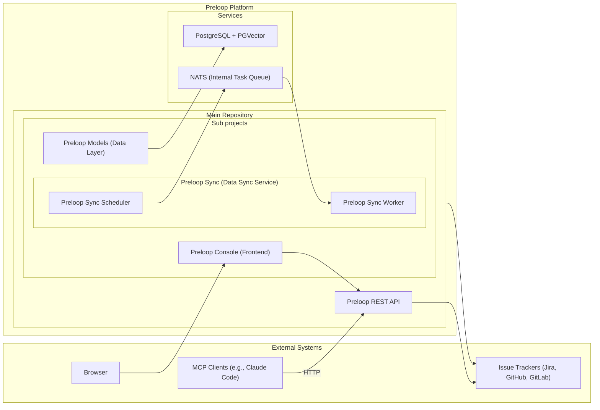
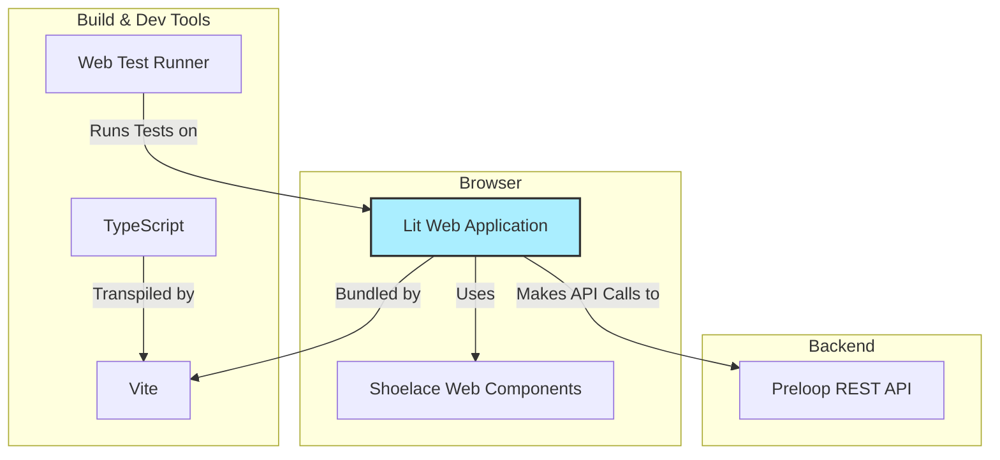
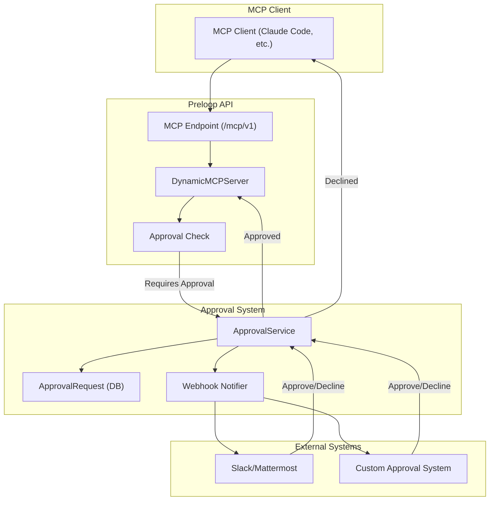
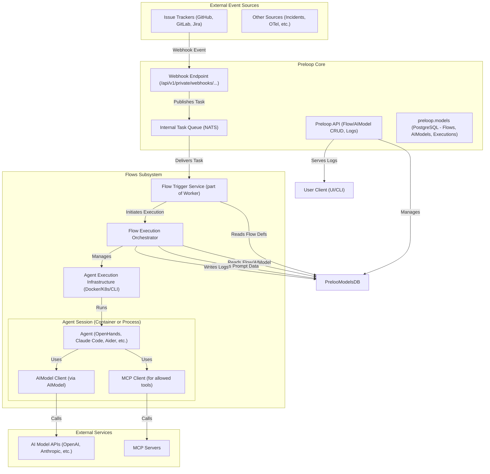
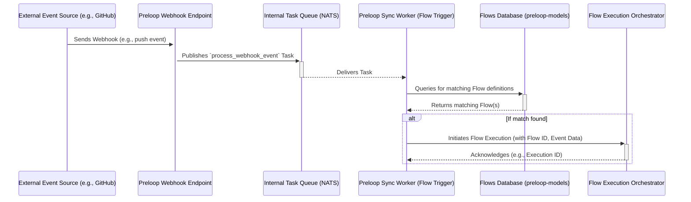
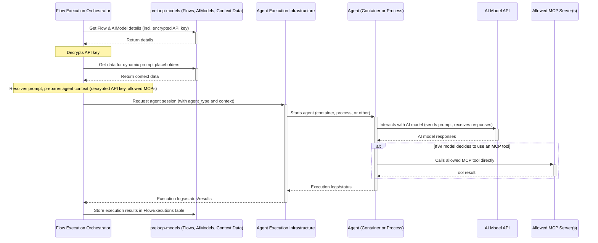
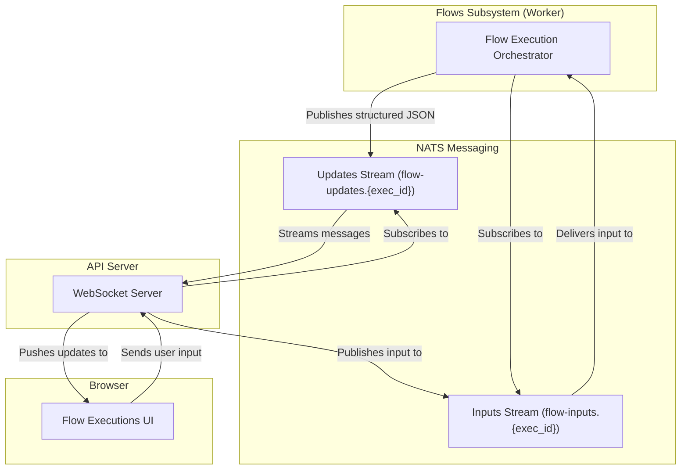

# Preloop Architecture

## System Overview

Preloop is an open-source, responsible AI automation platform. It can proxy tools from MCP servers, optionally adding a human approval layer with configurable policies. It provides event-driven agentic flows to intelligently automate common tasks using any agent framework like Claude Code, Codex CLI, Aider or OpenHands. It integrates with issue & code tracking systems like Jira, GitHub, GitLab, both for listening to events and for ingesting issues, comments, documentation and code. By leveraging vector-based similarity search, Preloop detects duplicate and overlapping issues, detects unmapped dependencies, evaluates compliance metrics, and offers intelligent suggestions to streamline workflows. The architecture emphasizes flexibility, performance, and ease of integration, providing access via a REST API, a web UI, and an MCP server for various clients.

## High-Level Architecture



**Key Components:**

*   **Preloop REST API:** The core FastAPI application providing the HTTP interface.
*   **Preloop Models:** Handles database interactions, defining SQLAlchemy models, Pydantic schemas, and CRUD operations. Manages the PostgreSQL database connection and PGVector operations.
*   **Preloop Sync:** A service responsible for polling external issue trackers, processing data, generating embeddings, and storing/updating information in the database via `Preloop Models`. The preloop-sync cli can launch one-off scan operations, or start the scheduler process that adds polling tasks to the NATS queue. The NATS queue is consumed by the Preloop Sync worker process.
    *   **Preloop Sync Scheduler:** A process that adds polling tasks to the NATS queue.
    *   **Preloop Sync Worker:** A process that consumes tasks from the NATS queue and processes them.
*   **Preloop Console:** A web application built using Lit, Vite, TypeScript, and Material Web Components.
*   **PostgreSQL + PGVector:** The database storing metadata and vector embeddings.
*   **NATS:** An event bus used for both a reliable task queue (JetStream) and real-time streaming updates. It decouples the API from the background processing of events and flows.
*   **External Systems:** Issue trackers and MCP clients interacting with the Preloop ecosystem.

## Frontend Architecture
The frontend is in the `frontend` directory.



### Technology Stack

*   **Framework:** [Lit](https://lit.dev/) - A simple library for building fast, lightweight web components. It provides reactive state, scoped styles, and a declarative templating system.
*   **Build Tool:** [Vite](https://vitejs.dev/) - A modern frontend build tool that provides an extremely fast development experience with features like Hot Module Replacement (HMR) and optimized production builds.
*   **Language:** [TypeScript](https://www.typescriptlang.org/) - A statically typed superset of JavaScript that enhances code quality and maintainability.
*   **UI Components:** [Shoelace](https://shoelace.style/) - A set of high-quality, standards-based web components.
*   **Testing:** [Web Test Runner](https://modern-web.dev/docs/test-runner/overview/) - A tool for testing web applications in a real browser, ensuring that components behave as expected in a live environment.

### Structure

The `Preloop Console` application is structured around a component-based architecture.

*   **`src/components/`**: This directory contains all the custom Lit components that make up the application. Each component is typically defined in its own file (e.g., `tracker-list.ts`) and may have a corresponding test file (e.g., `tracker-list.test.ts`).
*   **`src/api.ts`**: A dedicated module for handling communication with the Preloop REST API. It encapsulates fetch logic, authentication, and data transformation.
*   **`index.html`**: The main entry point for the application.
*   **`vite.config.ts`**: Configuration for the Vite build tool.
*   **`package.json`**: Defines project metadata, dependencies, and scripts for development, building, and testing.

#### Tools Page (`src/views/authed/tools-view.ts`)

The Tools page has been redesigned from a card-based layout to a tree-style list view:

*   **Summary stats table:** Interactive statistics panel showing tool counts (total, available/unavailable, enabled/disabled, built-in/proxied, with rules/no rules, require approval/no approval, approval workflows). Each stat is a clickable filter link.
*   **Unified filter system:** Single active filter at a time, text search, and approval workflow filter dropdown.
*   **Tool groups:** Tools grouped by source — external MCP servers listed first, then HTTP tools, then built-in tools.
*   **Import/Export:** Full configuration export/import as YAML.
*   **Key components:**
    *   `tool-list-item.ts` — Individual tool row with expand/collapse, enable/disable toggle, rule summary badges, and drag-and-drop rule reordering.
    *   `tool-rule-editor.ts` — Dialog for creating/editing access rules with action selection (deny/require approval/allow), condition builder (simple or CEL), and approval workflow configuration (human or AI-driven).
    *   `approval-policy-dialog.ts` — Dialog for creating/editing approval workflows.
*   **Access rule UI semantics:** Actions use semantic icons and colors — Deny (red, `x-octagon-fill`), Require Approval (blue/primary, `shield-lock-fill`), Allow (green, `check-circle-fill`).

## Core Components

### Preloop API Server (Main Repository)
*   **Framework:** FastAPI-based RESTful API server.
*   **Authentication:** JWT authentication and authorization.
*   **MCP Server:** Includes integrated MCP tool endpoints under `/api/v1/mcp/` for direct communication with MCP clients over HTTP.
*   **Validation:** Request validation using Pydantic models (defined in `preloop.models`).
*   **Documentation:** Automatic API documentation with Swagger/ReDoc.
*   **Features:** Rate limiting, error handling, monitoring integration.
*   **Interaction:** Communicates with `preloop.models` for database operations and directly with Issue Tracker APIs for certain actions (e.g., creating/updating issues in real-time).

### preloop.models (`./backend/preloop/models`)
*   **Purpose:** Data modeling and database interaction layer.
*   **Technology:** SQLAlchemy for ORM, Pydantic for data validation/schemas.
*   **Database:** Defines schema for PostgreSQL, including tables for organizations, projects, issues, embeddings, etc.
*   **Vector Store:** Integrates with PGVector for storing and querying issue embeddings.
*   **Operations:** Provides CRUD (Create, Read, Update, Delete) functions for all database entities.
*   **Migrations:** Uses Alembic for database schema evolution.

### Preloop Sync ( `./backend/preloop/sync`)
*   **Purpose:** Data synchronization and embedding generation service.
*   **Functionality:**
    *   The `preloop.sync` CLI can launch one-off scan operations or start a persistent scheduler.
    *   **Scheduler:** Periodically adds polling tasks for each configured tracker to the NATS queue.
    *   **Worker:** Consumes tasks from the NATS queue. Multiple, specialized worker groups can be deployed, each subscribing to a specific subset of tasks (e.g., polling, webhooks). This allows for independent scaling and monitoring of different task types.
*   **Execution:** Runs as two distinct, long-running processes (scheduler and worker) or as a one-off CLI command.


### Issue Tracker Clients (within Preloop Sync)
*   **Location:** Implementations reside within Preloop Sync.
*   **Structure:** Abstract base classes define common interfaces (`get_issue`, `create_issue`, etc.).
*   **Implementations:** Concrete classes for each supported tracker (Jira, GitHub, GitLab).
*   **Features:** Handles authentication, API specifics, rate limiting, and error mapping for each tracker.

### Backend Project Structure

The backend codebase is organized to separate concerns between the data models, synchronization logic, and the API server.

*   **`backend/preloop/models/`**:
    *   **`models/`**: SQLAlchemy models defining the database schema (e.g., `issues.py`, `projects.py`).
    *   **`schemas/`**: Pydantic models for data validation and API I/O.
    *   **`crud/`**: Database access operations (Create, Read, Update, Delete).
    *   **`db/`**: Database connection and session management.
    *   **`alembic/`**: Database migration scripts.

*   **`backend/preloop/sync/`**:
    *   **`scanner/`**: Core logic for polling trackers and processing data.
    *   **`trackers/`**: Client implementations for different issue trackers (Jira, GitHub, GitLab).
    *   **`embeddings/`**: Logic for generating vector embeddings from issue text.
    *   **`scheduler/`**: Task scheduling logic for regular synchronization.
    *   **`worker/`**: Worker process logic for consuming tasks from NATS.

*   **`backend/preloop/api/`**:
    *   **`endpoints/`**: API route definitions grouped by resource.
    *   **`auth/`**: Authentication logic and router.
    *   **`app.py`**: FastAPI application entry point.

### Tracker Scope Rules

**Purpose:** TrackerScopeRule provides fine-grained control over which organizations and projects within a tracker are synchronized and accessible. This allows users to focus on relevant data and reduce noise.

**Data Model:** Defined in `backend/preloop/models/models/tracker_scope_rule.py`

*   **Fields:**
    *   `tracker_id`: Foreign key to the Tracker
    *   `scope_type`: Enum - `ORGANIZATION` or `PROJECT`
    *   `rule_type`: Enum - `INCLUDE` or `EXCLUDE`
    *   `identifier`: String - the organization or project identifier (e.g., `"my-org"` or `"my-org/my-repo"`)

**Filtering Logic:** The following rules are applied consistently across all components (Preloop Sync scanner, API endpoints, cleanup scripts):

1.  **Organization Level (Required):**
    *   An organization MUST have an `INCLUDE` rule to be processed.
    *   Organizations can have `EXCLUDE` rules, but these are currently unused (organizations are opt-in via `INCLUDE` only).
    *   If an organization is not explicitly included, all its projects are skipped.

2.  **Project Level (Within Included Organizations):**
    *   For each included organization, projects are filtered using **EITHER** include rules **OR** exclude rules, **NOT BOTH**.
    *   **Include Mode:** If any `PROJECT` + `INCLUDE` rules exist for projects within an organization, **ONLY** those explicitly listed projects are processed. All other projects in that organization are skipped.
    *   **Exclude Mode:** If only `PROJECT` + `EXCLUDE` rules exist for projects within an organization (and no `PROJECT` + `INCLUDE` rules), then **ALL** projects **EXCEPT** the excluded ones are processed.
    *   **No Project Rules:** If there are no project-level rules for an organization, **ALL** projects within that organization are processed (default behavior).

**Important Constraints:**

*   **Mutual Exclusivity:** An organization **MUST NOT** have both `PROJECT` + `INCLUDE` and `PROJECT` + `EXCLUDE` rules. This would create ambiguous filtering logic.
    *   ✅ Valid: Org has only `PROJECT` + `INCLUDE` rules (whitelist mode)
    *   ✅ Valid: Org has only `PROJECT` + `EXCLUDE` rules (blacklist mode)
    *   ✅ Valid: Org has no project-level rules (all projects included)
    *   ❌ Invalid: Org has both `PROJECT` + `INCLUDE` and `PROJECT` + `EXCLUDE` rules

**Validation:** The system should validate that no organization has conflicting project-level rules when scope rules are created or updated. This validation should be implemented at:

*   API endpoints that create/update TrackerScopeRule records
*   Database constraints (if feasible)
*   UI validation when configuring tracker scopes

**Implementation Locations:**

*   **Scanner (Preloop Sync):** `backend/preloop/sync/scanner/core.py` - Lines 73-191
    *   Filters organizations and projects during synchronization
    *   Skips organizations not in the include list
    *   Applies project include/exclude logic
*   **API (get_tracker_client):** `backend/preloop/api/common.py` - Lines 118-173
    *   Validates scope when a user requests access to a specific organization/project
    *   Returns HTTP 403 if access is denied
*   **API (get_accessible_projects):** `backend/preloop/api/common.py` - Lines 326-422
    *   Returns list of projects accessible to a user based on scope rules
    *   Used by search endpoints, project listing, and other features that query across projects
*   **API (Projects Endpoints):** `backend/preloop/api/endpoints/projects.py`
    *   `GET /projects` - Lists only accessible projects based on scope rules
    *   `GET /organizations/{organization_id}/projects` - Lists only accessible projects within an organization
*   **API (Search Endpoint):** `backend/preloop/api/endpoints/search.py`
    *   `GET /search` - Applies scope filtering to all search results (similarity and fulltext)
    *   Always filters by accessible projects, even when no project/org filter is specified
*   **Cleanup Script:** `preloop/backend/preloop/scripts/cleanup_out_of_scope_issues.py` - Lines 38-131
    *   Identifies issues that violate current scope rules
    *   Allows administrators to clean up out-of-scope data

**Example Configurations:**

*   **Scenario 1: Include specific organization, all projects**
    ```
    ORGANIZATION + INCLUDE: "my-org"
    (no project-level rules)
    Result: All projects in "my-org" are synced
    ```

*   **Scenario 2: Include specific organization, whitelist specific projects**
    ```
    ORGANIZATION + INCLUDE: "my-org"
    PROJECT + INCLUDE: "my-org/project-a"
    PROJECT + INCLUDE: "my-org/project-b"
    Result: Only "project-a" and "project-b" in "my-org" are synced
    ```

*   **Scenario 3: Include specific organization, blacklist specific projects**
    ```
    ORGANIZATION + INCLUDE: "my-org"
    PROJECT + EXCLUDE: "my-org/archived-project"
    PROJECT + EXCLUDE: "my-org/deprecated-project"
    Result: All projects in "my-org" EXCEPT "archived-project" and "deprecated-project" are synced
    ```

*   **Scenario 4: INVALID - Mixed include/exclude**
    ```
    ORGANIZATION + INCLUDE: "my-org"
    PROJECT + INCLUDE: "my-org/project-a"
    PROJECT + EXCLUDE: "my-org/project-b"
    Result: ❌ INVALID - This configuration should be rejected
    ```

### Database (PostgreSQL + PGVector)
*   **Role:** Central data store for metadata and vector embeddings.
*   **Managed by:** `preloop.models` module.
*   **Key Features:** Relational data storage, efficient vector similarity search via PGVector.

## Data Flow

### REST API Flow (e.g., Searching Issues)
1.  **Client Request:** An HTTP client sends a `GET /api/v1/issues/search` request to the Preloop API server.
2.  **API Server:**
    *   Authenticates the request (JWT).
    *   Validates query parameters (using Pydantic models from `preloop.models`).
    *   Calls the appropriate service function.
3.  **Service Layer (API):**
    *   Generates an embedding for the search query.
    *   Calls a function in `preloop.models` to perform a vector similarity search in the PostgreSQL/PGVector database, potentially with metadata filters.
4.  **preloop.models:**
    *   Constructs and executes the SQL query against the database.
    *   Retrieves matching issue data.
5.  **API Server:** Formats the results and returns the HTTP response to the client.

### Data Synchronization Flow (Preloop Sync)
1.  **Trigger:** `preloop.sync scan all` command is executed.
2.  **Preloop Sync Service:**
    *   Retrieves tracker configurations using `preloop.models`.
    *   For each configured tracker:
        *   Uses the appropriate Issue Tracker Client to poll the external API (e.g., Jira API) for new/updated issues since the last scan.
        *   Processes the fetched issues.
        *   Generates vector embeddings for new/updated issue text.
        *   Calls functions in `preloop.models` to insert or update issue data and embeddings in the database.
3.  **preloop.models:** Interacts with the PostgreSQL database to persist changes.

### MCP Flow (Integrated HTTP)
1.  **MCP Client Request:** An MCP client (e.g., Claude Code) sends a tool request using streamable HTTP transport to the MCP server (e.g., `/mcp/v1`). The request includes the standard MCP payload and an `Authorization: Bearer <token>` header.
2.  **Preloop API Server:**
    *   Authenticates the request using the JWT token.
    *   Routes the request to the appropriate MCP tool endpoint.
    *   Validates the incoming MCP parameters against the Pydantic schema for that tool.
    *   Executes the tool logic, interacting with other Preloop services and `preloop.models` as needed.
    *   Formats the result into the standard MCP JSON response format.
3.  **MCP Client:** Receives the HTTP response containing the tool's output.

## Database Schema (Managed by preloop.models)

The detailed schema is defined using SQLAlchemy models within the `preloop.models` directory. Key tables include:

*   **Organizations:** Stores organization metadata, settings, and potentially user associations.
*   **Projects:** Contains project details, tracker configurations (type, API URL, credentials), and links to organizations.
*   **Trackers:** Holds specific tracker instance details and encrypted credentials.
*   **Issues:** Stores core issue data (ID, title, description, status, labels, etc.) synchronized from trackers.
*   **Issue Embeddings:** Contains vector embeddings (using PGVector `vector` type) linked to issues, used for similarity search.
*   **Other Metadata:** Tables for comments, users, API keys, etc., as needed.

Schema migrations are managed using Alembic within `preloop.models`.

## Technical Decisions

### REST API Implementation
Preloop implements a RESTful HTTP API using FastAPI, which provides:
- High performance with Starlette and Pydantic
- Automatic OpenAPI documentation generation
- Type annotation-based parameter validation
- Native async/await support
- Dependency injection system
- Middleware for authentication, logging, etc.

### MCP Implementation
The MCP server is implemented directly within the FastAPI application using a custom extension of FastMCP. This provides several advantages:
- **HTTP Transport:** Natively supports HTTP-based MCP clients via StreamableHTTP, enabling secure remote access.
- **Unified Authentication:** Leverages the same JWT authentication as the rest of the API.
- **Code Reusability:** Directly calls internal services and CRUD operations, reducing code duplication.
- **Scalability:** Benefits from the same deployment and scaling infrastructure as the main API.

#### Dynamic Tool Filtering
The MCP server implements per-user dynamic tool filtering using `DynamicFastMCP`, a custom subclass of FastMCP:

**Implementation Details:**
- **`DynamicFastMCP`** (`preloop/services/dynamic_fastmcp.py`): Extends FastMCP and overrides `_list_tools()` and `_mcp_call_tool()` methods
- **Tool Visibility:** Default tools (get_issue, create_issue, update_issue, search, estimate_compliance, improve_compliance) are only visible when the authenticated account has one or more trackers configured
- **User Context Propagation:** Uses Python's `ContextVar` for async-safe user context storage across request boundaries
- **Authentication:** `PreloopBearerAuthBackend` validates JWT tokens and injects user context into the request scope
- **Middleware:** `UserContextMiddleware` extracts authenticated user info and stores it in a ContextVar for access during tool listing and execution
- **StreamableHTTP Transport:** Uses FastMCP's proven `http_app(transport="streamable-http")` implementation for bidirectional streaming
- **Endpoint:** Mounted at `/mcp/v1` with full authentication and lifespan management

**Tool Registration:**
All built-in tools are registered in `preloop/services/initialize_mcp.py` using FastMCP's `@mcp.tool()` decorator, then filtered at runtime based on user context.

**Benefits:**
- Zero performance overhead for tool registration (happens once at startup)
- Dynamic filtering happens only during tool list requests
- Full compatibility with FastMCP's StreamableHTTP implementation
- Backward compatible with existing authentication infrastructure

### Tool Configuration and Approval Workflow

Preloop includes comprehensive infrastructure for managing tool configurations and implementing human-in-the-loop approval workflows for sensitive tool operations.

#### Tool Configuration Management

**Database Models:**
- **`ToolConfiguration`**: Defines which tools are enabled for an account, their configuration parameters, and approval requirements
  - Links to an optional `ApprovalWorkflow` for tools requiring human approval
  - Supports both default (built-in) and proxied (external MCP server) tools
  - Stores tool-specific configuration in JSONB format

- **`ApprovalWorkflow`**: Defines rules for when and how tool executions require approval
  - Configurable approval modes: manual, auto-approve, auto-reject
  - Optional webhook integration for external approval systems
  - Supports workflow-specific settings (e.g., timeout duration, required approvers)

#### Approval Workflow Architecture



**Approval Flow:**
1. MCP client initiates a tool call through the `/mcp/v1` endpoint
2. `DynamicMCPServer` checks if the tool requires approval via `_check_approval_required()`
3. If approval is required:
   - `ApprovalService.create_and_notify()` creates an `ApprovalRequest` record
   - Webhook notifications are sent to configured channels (Slack, Mattermost, custom endpoints)
   - The service waits for approval with configurable timeout
4. Approver reviews request and responds via:
   - Public approval API endpoint (`/approval/{request_id}/decide`)
   - Direct API call to Preloop
5. On approval, tool execution proceeds; on decline, error is returned to client

**API Endpoints:**
- `GET /api/v1/tool-configurations` - List all tool configurations for account
- `POST /api/v1/tool-configurations` - Create new tool configuration
- `PUT /api/v1/tool-configurations/{id}` - Update tool configuration
- `DELETE /api/v1/tool-configurations/{id}` - Delete tool configuration
- `GET /api/v1/approval-workflows` - List approval workflows
- `POST /api/v1/approval-workflows` - Create approval workflow
- `GET /api/v1/approval-requests` - List approval requests
- `GET /approval/{id}/data` - Public endpoint for getting approval request details (token-based)
- `POST /approval/{id}/decide` - Public endpoint for approval responses (token-based)

#### Access Rules System

The tool configuration system has been expanded with a **ToolAccessRule** model that replaces the simpler ToolApprovalCondition approach.

**ToolAccessRule Model** (`backend/preloop/models/models/tool_access_rule.py`):

| Field | Description |
|-------|-------------|
| `action` | "allow", "deny", or "require_approval" |
| `condition_expression` | CEL expression for conditional evaluation (e.g., `args.environment == "production"`) |
| `condition_type` | "simple" or "cel" |
| `priority` | Integer for rule ordering (evaluated in priority order, first match wins) |
| `description` | Human-readable description (for deny rules, returned as denial message to the agent) |
| `is_enabled` | Toggle individual rules on/off |
| `approval_workflow_id` | Links to an ApprovalWorkflow for "require_approval" rules |

**Evaluation:** Rules are evaluated at runtime in `DynamicFastMCP._evaluate_policy()` — the first matching enabled rule determines the action. If no rules match, the tool call is allowed by default (but audited in EE).

**Access Rule API Endpoints:**
- `POST /api/v1/tool-configurations/{config_id}/access-rules` - Create access rule
- `PUT /api/v1/access-rules/{rule_id}` - Update access rule
- `DELETE /api/v1/access-rules/{rule_id}` - Delete access rule

### MCP Server Management

Preloop supports configuration and management of external MCP servers, enabling tool proxying and federation.

**Database Model:**
- **`MCPServer`**: Stores configuration for external MCP servers
  - Connection details (URL, transport type, authentication)
  - Status tracking (active, inactive, error)
  - Tool discovery and caching
  - Account-scoped isolation

**Features:**
- Automatic tool discovery from external MCP servers
- Connection pooling and health checking via `MCPClientPool`
- Support for multiple authentication schemes (bearer token, API key, none)
- StreamableHTTP and SSE transport protocols
- Tool scanning and metadata caching

**API Endpoints:**
- `GET /api/v1/mcp-servers` - List configured MCP servers
- `POST /api/v1/mcp-servers` - Add new MCP server
- `PUT /api/v1/mcp-servers/{id}` - Update MCP server configuration
- `DELETE /api/v1/mcp-servers/{id}` - Remove MCP server
- `POST /api/v1/mcp-servers/{id}/scan` - Trigger tool discovery scan
- `GET /api/v1/mcp-servers/{id}/tools` - List tools available on server

### Language and Framework
Python is chosen as the primary language due to its strong ecosystem for machine learning and data processing, which is essential for similarity search and embedding generation. FastAPI is used for the REST API due to its performance, type safety, and automatic OpenAPI documentation generation.

### Database
PostgreSQL with the PGVector extension is used. The `preloop.models` module encapsulates all database interaction logic, providing a clean separation from the API and synchronization services. This allows for centralized data management and schema evolution.

### Authentication & Authorization

Preloop implements authentication and multi-tenancy:

**Authentication:**
- JWT-based authentication for REST API and MCP endpoints
- Token-based authentication with refresh token support
- Email verification for new user accounts
- Integration points for SSO and OAuth providers (future)

**Multi-User Architecture:**
- **Account Model:** Represents an organization/company
- **User Model:** Represents individual users within an account
- All data is scoped by `account_id` for multi-tenancy isolation

**Security Features:**
- Password hashing with industry-standard algorithms
- Account-level data isolation (all queries filtered by `account_id`)
- User invitation system with secure token-based email verification

**Plugin System:**
- Extensible plugin architecture for adding custom functionality
- Plugins can provide services, API routes, middleware, and dependencies
- Built-in plugins: Argument-based condition evaluator for approval workflows
- Plugin discovery via module paths or file system paths
- Lifecycle hooks: `on_startup()` and `on_shutdown()`

> **Enterprise Features**: Preloop Enterprise Edition adds RBAC with 7 system roles, 32 fine-grained permissions, team management, and comprehensive audit logging. Contact sales@preloop.ai for more information.

### Deployment
The system is designed to be containerized using Docker, enabling easy deployment in various environments including Kubernetes clusters. Stateless components enable horizontal scaling under load.

## Security Considerations

- [x] All API requests authenticated via JWT tokens
- [x] Multi-tenant data isolation (all queries scoped by account_id)
- [x] User invitation system with secure token-based verification
- [x] Password hashing with industry-standard algorithms
- [x] Input validation for all parameters via Pydantic models
- [ ] Issue tracker credentials encrypted at rest (currently stored securely but not encrypted)
- [ ] Sensitive data masked in logs
- [ ] Rate limiting to prevent abuse (partial implementation exists)
- [ ] 2FA/MFA support for user accounts
- [ ] Session management and token revocation
- [ ] Regular security audits and dependency updates

> **Enterprise Security**: Preloop Enterprise Edition adds RBAC, comprehensive audit logging, and impersonation tracking for compliance requirements. Contact sales@preloop.ai for more information.


## Real-Time Communication

Preloop uses WebSocket connections for real-time updates:

### Unified WebSocket Architecture

Single WebSocket connection per client with pub/sub message routing:

**MessageRouter** (`backend/preloop/services/message_router.py`):
- Routes messages to topic-based subscribers
- Supports wildcard subscriptions (`'*'` topic)
- Optional per-subscriber filter functions
- Topics: `flow_executions`, `approvals`, `system`

**Benefits:**
- Single WebSocket reduces connection overhead
- Scalable pub/sub pattern
- Easy to add new message types/topics
- Clear separation of concerns

> **Enterprise Features**: Preloop Enterprise Edition adds session management, activity tracking, user impersonation with audit logging, and billing integration. Contact sales@preloop.ai for more information.

## Event-Driven Agentic Flows

This section details the architecture for the "Event-Driven Agentic Flows" (Flows) feature, enabling automated workflows triggered by various events and executed by AI agents.

### 1. Overview and Goals

The "Flows" feature allows users to define automated workflows that are initiated by events from integrated systems (e.g., GitHub, GitLab, Jira) or other sources (e.g., incidents, OpenTelemetry data). Each Flow leverages a configurable AI model and a dynamic prompt to perform tasks, potentially utilizing specified MCP (Meta-Cognitive Prompting) servers and tools.

**Key Goals:**

*   **Event-Driven Automation:** Trigger workflows based on specific events (e.g., commit to main, new issue, PR merged, incident triggered).
*   **Dynamic Prompting:** Allow prompts to be constructed dynamically, incorporating project-specific context (e.g., documentation summaries, code component maps).
*   **Configurable AI Models:** Enable users to select and configure different AI models for different Flows, managing API keys securely.
*   **Controlled Tool Usage:** Provide a mechanism to specify which MCP servers and tools an AI agent can use during a Flow's execution.
*   **Extensibility:** Design for easy addition of new event sources, AI models, and agent capabilities.
*   **User Experience:** Allow users to define Flows from presets, customize existing ones, or create them from scratch. The UI should be intuitive and guide the user through the process of creating and configuring a flow.

### 2. Key Components & Their Roles



*   **Flow Definition (`Flows`):**
    *   Stored in `preloop-models`.
    *   Details the triggering event, prompt template, selected `AIModel` ID, agent type (e.g., "codex", "gemini", "openhands", "aider"), agent configuration (e.g., specific agent parameters), and a list of allowed MCP servers and specific tools.
    *   Presets are implemented as special, non-editable (or cloneable) records in this table.
*   **AI Model (`AIModel`):**
    *   Stored in `preloop-models`.
    *   Reusable definitions for AI models, including their identifiers (e.g., `openai/gpt-4`), API endpoints, and credentials.
    *   For initial implementation, API keys will be stored unencrypted directly in the database. A future enhancement will integrate a secrets management solution like OpenBAO.
    *   Models are linked to an `Account`.
*   **Event Ingestion:**
    *   Primarily through the existing webhook endpoint (e.g., `/api/v1/private/webhooks/{tracker_type}/{org_identifier}`) for tracker events.
    *   This endpoint validates incoming webhooks and then publishes a `process_webhook_event` task to the **Internal Task Queue (NATS)**.
*   **Internal Task Queue (NATS):**
    *   NATS is used as a simple, reliable task queue. It decouples the API from the background processing of events and flows.
    *   The `EventBus` service is used to enqueue tasks.
    *   Workers consume tasks from the `preloop_sync.tasks` subject using a `workqueue` retention policy, which ensures that acknowledged messages are immediately removed from the stream.
*   **Flow Trigger Service:**
    *   This logic is part of the NATS worker. When a `process_webhook_event` task is received, the worker acts as the trigger service.
    *   It matches the incoming event data against the `trigger_event_source` and `trigger_event_type` defined in active `Flows`.
    *   Upon a match, it initiates a Flow execution by invoking the Flow Execution Orchestrator.
*   **Flow Execution Orchestrator:**
    *   Responsible for managing the lifecycle of a single Flow execution.
    *   Retrieves the `Flow` definition and its associated `AIModel` (including the encrypted API key) from the database.
    *   **Dynamic Prompt Resolution:** Parses the `prompt_template` and resolves any placeholders (e.g., `{{project_docs_summary}}`, `{{relevant_code_files}}`) by querying `preloop-models` or other Preloop services for the necessary context data.
    *   Decrypts the API key and prepares the complete execution context for the agent, including the fully resolved prompt, AI model details (model name, API endpoint, decrypted API key), and the specific list of allowed MCP servers/tools.
    *   Initiates and manages an agent session via the Agent Execution Infrastructure based on the configured `agent_type`.
    *   Monitors the execution and records results/logs.
*   **Agent Execution Infrastructure:**
    *   Manages the runtime environment for agentic workflows.
    *   **Production Mode (Container-based):** All agents run in isolated containers (Docker or Kubernetes) for security, isolation, and scalability. Each Flow execution spawns a new container regardless of agent type.
    *   **Development Mode (Optional):** For local development only, CLI-based agents can be run as processes to simplify testing and iteration.
    *   Provides an abstraction layer for different agent types:
        *   **Codex CLI**
        *   **Gemini CLI**
        *   **OpenHands**: Container with the OpenHands library and runtime dependencies
        *   **Aider**: Container with `aider` CLI and dependencies pre-installed

    *   The Flow Execution Orchestrator interacts with this infrastructure to start, monitor, and terminate agent sessions.
*   **Agent (running in a container):**
    *   The core agentic execution environment running in an isolated container (or process in dev mode).
    *   Supported agent types:
        *   **Codex CLI**
        *   **Gemini CLI**
        *   **OpenHands**: Library-based agent (default implementation)
        *   **Aider**: CLI-based agent using `aider` command
        *   **Other agents**: Extensible to support additional agent frameworks
    *   Receives the resolved prompt, AI model configuration, and allowed MCP toolset from the Flow Execution Orchestrator.
    *   Manages the interaction with the configured AI model.
    *   **Direct MCP Calls:** The agent can directly call the allowed MCP tools on the specified MCP servers, with necessary network access and authentication provided by the execution infrastructure.
*   **Flow Execution Log (`FlowExecutions`):**
    *   A database table in `preloop-models` to record the history and outcome of each Flow run.
    *   Includes details like the triggering event, start/end times, status (pending, running, succeeded, failed), the resolved input prompt, a summary of actions taken by the agent, logs of MCP tool usage, and a reference to more detailed logs from the agent session (e.g., container logs, session ID, or process output).
*   **Preloop API Extensions:**
    *   New API endpoints will be added to the `Preloop API` for:
        *   CRUD (Create, Read, Update, Delete) operations on `Flows` and `AIModels`.
        *   Listing and retrieving `FlowExecution` history and logs.
        *   Managing Flow presets (e.g., listing, cloning).

### 3. Database Schema Considerations

The following Pydantic schemas and corresponding SQLAlchemy models have been defined within `preloop-models`:

*   **`Flow`**
*   **`AIModel`**
*   **`FlowExecution`**

### 4. Data Flow Diagrams

*(Mermaid diagrams will be used here as shown in the "Key Components" section and expanded as needed for specific flows.)*

**a. Event Ingestion & Flow Triggering:**



**b. Flow Execution (Simplified):**



### 5. Real-Time UI Updates & Interactivity

To provide users with live feedback and enable future interactivity with Flow executions, a structured, message-based real-time architecture will be implemented.



**Components & Protocol:**

*   **Structured Messaging:** Communication uses a standardized JSON envelope, allowing for different message types. This is critical for future extensibility.
    ```json
    {
      "execution_id": "uuid-of-the-flow-execution",
      "timestamp": "iso-8601-timestamp",
      "type": "message_type",
      "payload": { ... }
    }
    ```
*   **NATS Streams:**
    *   **`flow-updates.{execution_id}`:** A server-to-client stream for broadcasting updates from the `FlowExecutionOrchestrator`. This will be implemented now.
    *   **`flow-inputs.{execution_id}`:** A client-to-server stream for sending user input back to the `FlowExecutionOrchestrator`. This is reserved for future interactive features.
*   **WebSocket Server:** The server will handle routing messages between the browser and the appropriate NATS streams.
*   **Initial Message Types:** For the first implementation, the following message types will be supported in the `flow-updates` stream:
    *   `status_update`: For lifecycle changes (e.g., `RUNNING`, `SUCCEEDED`).
    *   `log`: For streaming text output from the agent.
    *   `tool_call`: For structured information about tools being used.
*   **Future Extensibility:** This design allows for the seamless addition of new message types to support interactivity (`user_input_request`, `user_input_response`) or advanced capabilities (`ui_control_command`) without requiring architectural changes.
    *   CRUD operations for these new entities will be added to `preloop-models`.
    *   Will be queried by the Flow Execution Orchestrator to resolve dynamic prompt content.
*   **`Preloop Sync` / Webhook Infrastructure:**
    *   The existing webhook ingestion mechanism within the main `Preloop API` will publish a `process_webhook_event` task to the NATS task queue.
    *   The `Preloop Sync` worker, upon receiving this task, will be responsible for triggering the appropriate Agentic Flows.
*   **`Preloop API`:**
    *   Will be extended with new RESTful API endpoints for:
        *   Managing `Flows` (CRUD, enable/disable, list presets).
        *   Managing `AIModels` (CRUD, share).
        *   Retrieving `FlowExecution` history, status, and logs (including links or content from OpenHands logs).
*   **`Preloop-MCP` (and other MCP Servers):**
    *   MCP servers are *consumers* in this context. The OpenHands agents, as configured per Flow, will directly call tools on these MCP servers.
    *   The `Flow` definition will specify which MCP servers and which specific tools on those servers the agent is permitted to use.

### 6. Agent Integration - Key Aspects

*   **Agent Type Selection:** The `Flow.agent_type` field specifies which agent implementation to use (e.g., 'codex', 'gemini', 'openhands', 'aider'). The Agent Execution Infrastructure uses this to determine how to start and manage the agent session.
*   **Agent Configuration:** The `Flow.agent_config` field stores JSON with agent-specific configuration:
    *   **OpenHands**: `{"agent_type": "CodeActAgent", "max_iterations": 10}`
    *   **Claude Code**: `{"model": "claude-3-5-sonnet", "max_tokens": 4096}`
    *   **Aider**: `{"model": "claude-3-5-sonnet", "auto_test": true, "edit_format": "diff"}`
*   **Dynamic Prompts:** The Flow Execution Orchestrator resolves placeholders in `Flow.prompt_template` *before* passing the final prompt to any agent.
*   **AI Model Selection & API Key Management:**
    *   `Flow.ai_model_id` links to a `AIModel` record.
    *   `AIModel.api_key` stores the API key in the database (unencrypted for initial implementation).
    *   The Flow Execution Orchestrator retrieves the API key and passes it securely to the agent session via environment variables or secure configuration specific to that session. (Future: Retrieve from OpenBAO via a reference).
*   **MCP Tool Discovery & Invocation:**
    *   The `Flow.allowed_mcp_servers` and `Flow.allowed_mcp_tools` define the explicit allowlist.
    *   The agent environment is configured to make network calls to these allowed MCP servers.
    *   If MCPs require authentication, the Flow Execution Orchestrator injects necessary tokens/keys for *only* the allowed MCPs into the agent session.
    *   Agent-specific mechanisms are used to expose MCP tools (e.g., OpenHands' tool/action definitions, MCP configuration files for CLI agents).

### 7. Security Considerations

*   **API Key Security:**
    *   **Initial Implementation:** AI model API keys (`AIModel.api_key`) will be stored unencrypted in the database.
    *   **Future Enhancement (OpenBAO Integration):** An issue should be tracked to migrate to storing API keys in OpenBAO (or a similar dedicated secrets management system). The database would then store only a reference to the secret in OpenBAO.
    *   The Flow Execution Orchestrator needs appropriate permissions to decrypt these keys (initial phase) or retrieve them from the vault (future phase) at runtime and inject them securely into the OpenHands agent's environment.
    *   Least privilege access for the orchestrator to decryption keys or the secrets vault.
*   **MCP Access Control:**
    *   The `allowed_mcp_servers` and `allowed_mcp_tools` in the `Flow` definition act as a strict allowlist.
    *   The OpenHands agent environment must be configured (e.g., network policies if running in Kubernetes, or wrapper logic around tool calls) to prevent calls to unlisted MCPs or tools.
    *   Consider if MCPs themselves have authentication/authorization; if so, the Flow execution might need to propagate user/Flow identity or use pre-configured service accounts.
*   **Input Validation & Sanitization:**
    *   Validate all inputs for Flow definitions, especially prompt templates and configurations.
    *   Sanitize any data from events or dynamic context before it's incorporated into prompts to prevent injection attacks against the AI model or downstream tools.
*   **Resource Limits for Agents:**
    *   All agents (especially container-based ones) should have resource limits (CPU, memory, execution time) to prevent abuse or runaway processes.
*   **Logging and Auditing:**
    *   Comprehensive logging of Flow executions, including which MCP tools were called with what parameters (sensitive data redacted).
    *   Audit trails for changes to `Flows` and `AIModels`.
*   **Permissions:**
    *   Role-based access control (RBAC) for managing `Flows` and `AIModels` via the Preloop API. Users should only be able to create/edit/view Flows and AIModels within their authorized scope (e.g., organization).

### 8. Scalability and Extensibility

*   **Task Queue (NATS):** NATS is chosen for its high performance, lightweight nature, and scalability, allowing the system to handle a high volume of incoming tasks.
*   **Flow Trigger Service:** Can be scaled horizontally if event processing becomes a bottleneck. It should be stateless.
*   **Flow Execution Orchestrator:** Can also be scaled, though individual orchestration tasks might be stateful for the duration of a Flow.
*   **Agent Execution Infrastructure:**
    *   Leveraging containers (Docker or Kubernetes jobs) for all agent types is key to scalability and security. Each Flow execution runs in an isolated container.
    *   The system can be configured to run these containers on a Docker host (via socket) or a Kubernetes cluster, allowing for dynamic scaling of agent execution capacity based on demand.
    *   The orchestrator manages the lifecycle of these containerized jobs.
*   **Database:** `preloop-models` (PostgreSQL) should be monitored for performance. Read replicas can be used for read-heavy operations like fetching Flow definitions or execution logs.
*   **Extensibility:**
    *   **New Event Sources:** Add new parsers/adapters to publish `process_webhook_event` tasks. The Flow Trigger Service can then match these new event types.
    *   **New AI Models:** Add new `AIModel` records. The Flow Execution Orchestrator and agents need to be compatible with the new model's API.
    *   **New MCP Tools/Servers:** Update the allowlist options. Agents need to be able to make calls to these new tools.
    *   **New Agent Types:** Create new container images for additional agent frameworks. Update the Agent Execution Infrastructure to support the new agent type. The abstraction layer makes this straightforward.

### 9. Preset Use Case Examples

Example automated workflows that can be configured:

*   **Commit to `main` -> Doc/Test Check:** Evaluate if documentation or tests require updates and open issues or PRs with suggested changes.
*   **New Issue Created -> Triage & Label:** Analyze new issue content, suggest priority, labels, and potentially assign based on keywords.
*   **PR Merged -> Release Notes Draft:** Summarize changes and draft release notes.
*   **Downtime Incident -> Initial Investigation:** Check deployed version, telemetry data, and suggest remediation actions.
*   **New User Feedback -> Summarize & Categorize:** Parse feedback, categorize it, and create corresponding issues.
*   **Scheduled Code Quality Scan -> Analyze & Report:** Run static analysis and create tasks for critical issues.

> **Enterprise Features**: Preloop Enterprise Edition adds usage tracking, billing integration with Stripe, subscription management, and feature gating based on plan tiers. Contact sales@preloop.ai for more information.
