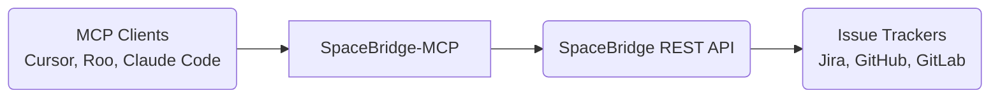

# SpaceBridge Documentation

## Overview

SpaceBridge is an open-source Model Context Protocol (MCP) server that provides a unified API for interacting with multiple issue tracking systems (GitHub, GitLab, Jira) from AI assistants. It functions as a bridge between AI agents and issue trackers by:

1. **Standardizing issue data across platforms** - converting between different trackers' schemas
2. **Providing similarity search and similarity matching** - finding related issues through vector embedding
3. **Exposing a consistent interface** - through both direct REST API and MCP-compliant stdio transport

Developed specifically for AI agent integration, SpaceBridge lets AI assistants create, update, and search for issues across multiple tracking systems without requiring separate integrations for each platform.


## Supported Issue Trackers

- GitHub Issues
- GitLab Issues
- Jira Cloud and Server (coming soon)
- Linear (coming soon)

## Architecture



### SpaceBridge-MCP

SpaceBridge-MCP acts as a bridge between MCP clients and the SpaceBridge REST API. When an MCP client invokes a tool, SpaceBridge-MCP:

- Receives the tool invocation via stdio
- Validates the parameters
- Translates the request to an HTTP call to the SpaceBridge REST API
- Returns the result back to the MCP client

### SpaceBridge REST API

The SpaceBridge REST API provides a set of endpoints for interacting with issue trackers. It supports operations such as:

- Creating new issues
- Updating existing issues
- Searching for issues
- Managing issue assignments
- Adding comments to issues

## Getting Started

### Prerequisites

- Python 3.9+
- pip (Python package installer)
- Access to a SpaceBridge instance and API key.
- OpenAI API Key (for the `create_issue` tool's duplicate check).

### Installation using pip

1.  Install the package:
    ```bash
    pip install spacebridge-mcp
    ```

### Installation from source

1.  Clone the repository:
    ```bash
    git clone <repository-url>
    cd spacebridge-mcp
    ```
2.  Create and activate a virtual environment (recommended):
    ```bash
    # Use .venv as requested by user
    python -m venv .venv
    source .venv/bin/activate  # On Windows use `.venv\Scripts\activate`
    ```
3.  Install the package in editable mode, including development dependencies (for testing):
    ```bash
    # Use the specific python from your virtual env if 'pip' isn't found directly
    .venv/bin/python -m pip install -e ".[dev]"
    # Or if 'pip' is correctly on PATH for the venv:
    # pip install -e ".[dev]"
    ```
    *Note: This installs the package such that changes to the source code are immediately reflected without reinstalling. Including `[dev]` installs packages needed for running tests, like `pytest` and `respx`.*

### Configuration

The server supports the following configuration values:

*   **SpaceBridge API Key:** Your API key for authenticating with SpaceBridge (required).
*   **OpenAI API Key:** Your API key for OpenAI, used by the `create_issue` tool for duplicate checking (required).
*   **SpaceBridge API URL:** The base URL for the SpaceBridge API (optional, defaults to the public SpaceBridge API if not set).

These values can be provided in three ways, with the following order of precedence (highest first):

1.  **Command-line Arguments:** Pass the required arguments when running the server:
    ```bash
    spacebridge-mcp-server \
      --spacebridge-api-key "YOUR_SB_KEY" \
      --openai-api-key "YOUR_OPENAI_KEY"
    ```
    *Optional:* If using a self-hosted instance, add the following argument:
    ```bash
    --spacebridge-api-url "YOUR_CUSTOM_URL"
    ```
    *(Use `spacebridge-mcp-server --help` to see all available arguments.)*

2.  **Environment Variables:** Set the required environment variables:
    ```bash
    export SPACEBRIDGE_API_KEY="YOUR_SB_KEY"
    export OPENAI_API_KEY="YOUR_OPENAI_KEY"
    # Then run:
    spacebridge-mcp-server
    ```
    *Optional:* If using a self-hosted instance, also set this variable:
    ```bash
    export SPACEBRIDGE_API_URL="YOUR_CUSTOM_URL"
    ```

3.  **.env File:** Create a file named `.env` in the directory where you run the server containing the required variables:
    ```dotenv
    # .env file content
    SPACEBRIDGE_API_KEY="YOUR_SB_KEY"
    OPENAI_API_KEY="YOUR_OPENAI_KEY"
    ```
    *Optional:* If using a self-hosted instance, add this line to the `.env` file:
    ```dotenv
    SPACEBRIDGE_API_URL="YOUR_CUSTOM_URL"
    ```
    The server will automatically load values from this file if it exists. Values from environment variables or command-line arguments will override those in the `.env` file.

**Note:** When configuring MCP clients like Claude code (see "Connecting MCP Clients" section), passing credentials via the client's `--env` flags effectively sets them as environment variables for the server process.

### Running the Server

Once installed and configured, you can run the server using the command defined in `pyproject.toml`:

```bash
spacebridge-mcp-server
```

The server will start listening for MCP connections via standard input/output (stdio) by default.

## Connecting MCP Clients

This server uses standard input/output (stdio) for communication. You need to configure your MCP client (e.g., Claude code, Windsurf, Cursor) to launch the `spacebridge-mcp-server` command and pass the required environment variables. The `spacebridge-mcp-server` command should be available in your environment's path.

### Configuring Claude Code with SpaceBridge

```bash
claude mcp add spacebridge \
  /full/path/to/your/spacebridge-mcp-server \
  --scope user \
  --env SPACEBRIDGE_API_KEY="your-spacebridge-api-key" \
  --env OPENAI_API_KEY="your-openai-api-key"
```

*Optional:* If using a self-hosted instance, add the following flag to the command above:
```bash
--env SPACEBRIDGE_API_URL="your-custom-url"
```
`--scope user` makes the server available across all your projects in Claude code. Use `--scope project` to limit it to the current project.

### Configuring Cursor with SpaceBridge

#### Method 1: Using the Cursor UI

1. Open Cursor and navigate to **Settings** > **Model Context Protocol**
2. Click **Add MCP Server**
3. Select **Add stdio Server**
4. Enter the following information:
   - **Name**: `SpaceBridge`
   - **Command**: Full path to `spacebridge-mcp-server` (see "Find Server Path" above)
   - **Environment Variables**: Add the following key-value pairs:
     - `SPACEBRIDGE_API_KEY`: Your SpaceBridge API key
     - `OPENAI_API_KEY`: Your OpenAI API key for similarity search
     *Optional:* Add `SPACEBRIDGE_API_URL` with your custom URL if using a self-hosted instance.

#### Method 2: Editing the Configuration File

1. **Project-specific configuration** (only available in this project):
   Create a file at `.cursor/mcp.json` in your project directory with:

   ```json
   {
     "mcpServers": {
       "spacebridge": {
         "command": "/full/path/to/spacebridge-mcp-server",
         "args": [],
         "env": {
           "SPACEBRIDGE_API_KEY": "your-spacebridge-api-key",
           "OPENAI_API_KEY": "your-openai-api-key"
         }
       }
     }
   }
   ```
   *Optional:* If using a self-hosted instance, add the following line inside the `env` object:
   ```json
           "SPACEBRIDGE_API_URL": "your-custom-url"
   ```

2. **Global configuration** (available in all projects):
   Create a file at `~/.cursor/mcp.json` in your home directory with the same structure as above.

Once configured, Cursor's AI assistant will automatically detect and use available SpaceBridge tools when relevant to your task. You can also explicitly tell the assistant to use SpaceBridge tools by mentioning them in your prompts.

### Configuring Windsurf with SpaceBridge

Windsurf uses a JSON configuration file to manage MCP servers. Here's how to set up SpaceBridge with Windsurf:

#### Editing the Configuration File

1. Create or edit the Windsurf MCP configuration file at `~/.codeium/windsurf/mcp_config.json` with the following content:

   ```json
   {
     "mcpServers": {
       "spacebridge": {
         "command": "/full/path/to/spacebridge-mcp-server",
         "args": [],
         "env": {
           "SPACEBRIDGE_API_KEY": "your-spacebridge-api-key",
           "OPENAI_API_KEY": "your-openai-api-key"
         }
       }
     }
   }
   ```
   *Optional:* If using a self-hosted instance, add the following line inside the `env` object:
   ```json
          "SPACEBRIDGE_API_URL": "your-custom-url"
   ```

The configuration file specifies:
- The path to the `spacebridge-mcp-server` executable
- Your SpaceBridge API key
- Your OpenAI API key for similarity search and duplicate detection
*Optional:* The `SPACEBRIDGE_API_URL` is only needed if using a self-hosted instance.

Once configured, Windsurf's AI assistant will automatically detect and use available SpaceBridge tools when relevant to your task. You can also explicitly tell the assistant to use SpaceBridge tools by mentioning them in your prompts.

### Using SpaceBridge

After configuration, you can use SpaceBridge features directly within your MCP-enabled IDE:

1. **Search for Issues**: Ask your IDE to search for issues related to your current task
2. **Create Issues**: Tell your IDE to create a new issue for a bug or feature request
3. **Link Code to Issues**: Ask your IDE to link your current code to relevant issues

### Usage Examples

Below are examples of how to interact with your AI assistant using SpaceBridge tools. Each example includes a description of what the prompt does and how the underlying MCP tools are utilized.

#### Searching for Issues

These prompts use the `search_issues` tool to find relevant issues across your connected trackers:

- **"Find issues related to authentication bugs"**
  *Performs a full-text search across all trackers for issues containing terms related to authentication problems. The search results will include issue titles, descriptions, and statuses from GitHub, GitLab, and other configured trackers.*

- **"Show me all open issues assigned to me in the frontend project"**
  *Searches for issues with specific filters applied (status: open, assignee: current user, project: frontend). Results are pulled from all connected trackers and normalized into a consistent format.*

- **"Find similar issues to the current error I'm seeing with the API timeout"**
  *Performs a similarity search to find conceptually related issues, even if they don't share the exact same keywords. This leverages embedding-based search to find issues describing similar problems.*

- **"What's the status of the user profile refactoring task?"**
  *Searches for issues related to user profile refactoring and returns their current status, including any linked issues or dependencies.*

#### Creating Issues

These prompts use the `create_issue` tool, which includes automatic duplicate detection:

- **"Create a new issue for this login page crash"**
  *Initiates the issue creation process, prompting for additional details about the login page crash. Before creating the issue, SpaceBridge automatically checks for potential duplicates using similarity search and presents them if found.*

- **"File a bug report: API returns 500 error when processing large file uploads"**
  *Creates a detailed bug report with a clear title and description containing the error details. SpaceBridge will format this appropriately for the target tracking system and provide an issue ID upon successful creation.*

- **"Create a feature request for dark mode support in the dashboard"**
  *Creates a new feature request issue with a standardized template. The AI may ask follow-up questions to gather requirements, use cases, and priority information before submitting.*

- **"Track a task: Refactor the authentication module to use the new OAuth flow"**
  *Creates a task-type issue with appropriate labels and a description that includes the technical scope of the refactoring work.*

#### Updating Issues

These prompts use the `update_issue` tool to modify existing issues:

- **"Update issue #123 to add more details about the browser compatibility problem"**
  *Modifies an existing issue by appending new information about browser compatibility issues to the description field.*

- **"Mark issue PROJ-456 as completed"**
  *Updates the status field of the specified issue to "completed" or the equivalent in the target tracking system (e.g., "closed" in GitHub, "done" in Jira).*

- **"Change the priority of the payment processing bug to critical"**
  *Updates the priority field of an issue focused on payment processing problems.*

- **"Add a comment to issue GL-789 explaining that this is blocked by the database migration"**
  *Adds a new comment to the specified issue with details about a blocking dependency.*

#### Advanced Usage

These examples showcase more complex workflows that combine multiple operations:

- **"Find all performance-related issues and create a new epic to track them"**
  *First searches for performance-related issues, then creates a new parent issue (epic) with the found issues linked as children or related issues.*

- **"Analyze code quality issues from the last sprint and summarize them in a new issue"**
  *Searches for code quality issues from a specific time period, then creates a summary issue with analysis and patterns from the found issues.*

- **"Link this function to issue #123 and add a comment explaining the implementation"**
  *Associates the current code context with an existing issue and adds detailed implementation notes as a comment.*

- **"Create follow-up tasks for all open bugs in the authentication system"**
  *Searches for open authentication bugs and creates linked follow-up task issues for each one that requires additional work.*

**Note:** The exact behavior and capabilities may vary depending on your connected trackers and their specific features. SpaceBridge normalizes these differences where possible to provide a consistent experience.
